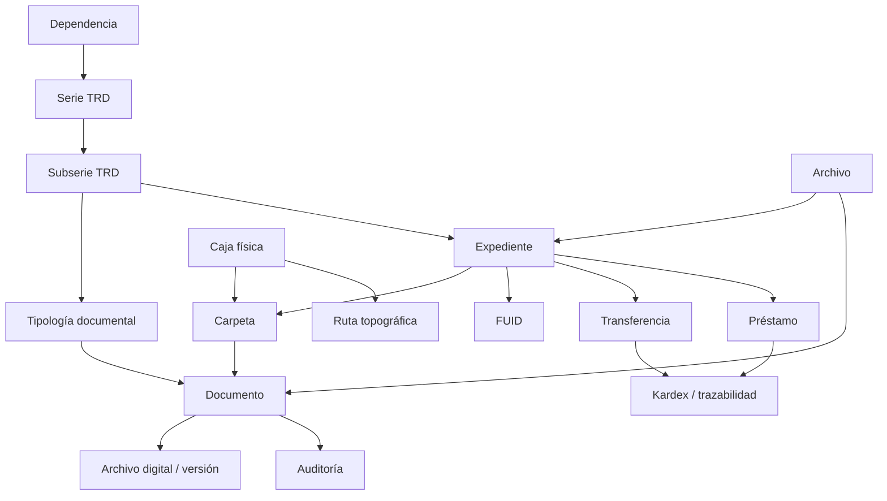

# Diccionario de base de datos AMBAR

Generado el 2026-07-13 21:46 desde los modelos SQLAlchemy actuales del backend.

> Nota: las descripciones funcionales combinan metadatos reales del modelo con inferencia técnica basada en nombres, relaciones y dominios de AMBAR. Para campos muy genéricos, validar con la regla de negocio del módulo antes de cambiar contratos de API.

## Resumen ejecutivo

- Tablas detectadas: **63**.
- Modelos ORM detectados: **63**.
- Dominios funcionales detectados: **20**.
- Motor lógico: la TRD gobierna documentos, expedientes, tipologías, retención, FUID, transferencias, custodia y trazabilidad.
- Seguridad: RBAC, permisos por archivo, auditoría, sesiones refresh, MFA y rate limiting se reflejan en tablas de seguridad y auditoría.

## Convenciones

- `PK`: llave primaria.
- `FK`: llave foránea hacia otra tabla.
- `Nullable`: indica si el campo permite valor nulo.
- `Default`: valor por defecto en aplicación o base de datos.
- Campos como `password_hash`, secretos MFA, tokens o API keys son sensibles y no deben exponerse en listados, exportaciones ni logs sin sanitización.
- Las tablas con prefijo `ps` pertenecen al esquema operativo principal de AMBAR.

## Mapa de dominios

### Archivo y custodia
- `ps930_archives` (`Archive`): Tabla del dominio Archivo y custodia. Administra registros de archives.

### Auditoría
- `ps820_audit_log` (`AuditLog`): Tabla del dominio Auditoría. Administra registros de audit log.

### Carpetas
- `ps952_folders` (`Folder`): Tabla del dominio Carpetas. Administra registros de folders.

### Digitalización y OCR
- `ps1200_ocr_jobs` (`OcrJob`): Tabla del dominio Digitalización y OCR. Administra registros de ocr jobs.
- `ps1202_ocr_results` (`OcrResult`): Tabla del dominio Digitalización y OCR. Administra registros de ocr results.

### Expedientes
- `ps950_expedients` (`Expedient`): Tabla del dominio Expedientes. Administra registros de expedients.

### FUID
- `ps956_inventory_fuid` (`InventoryFuid`): Tabla del dominio FUID. Administra registros de inventory fuid.

### Firmas
- `ps1240_signature_requests` (`SignatureRequest`): Tabla del dominio Firmas. Administra registros de signature requests.
- `ps1242_signature_events` (`SignatureEvent`): Tabla del dominio Firmas. Administra registros de signature events.

### Foliación
- `ps954_foliation` (`Foliation`): Tabla del dominio Foliación. Administra registros de foliation.

### General
- `ps1320_bi_snapshots` (`BiSnapshot`): Tabla del dominio General. Administra registros de bi snapshots.
- `ps934_shelves` (`Shelf`): Tabla del dominio General. Administra registros de shelves.

### Gestión documental
- `ps1072_transfer_batch_documents` (`TransferBatchDocument`): Tabla del dominio Gestión documental. Administra registros de transfer batch documents.
- `ps520_documents` (`Document`): Registros documentales. Cada documento queda asociado a archivo, expediente, carpeta, TRD y tipología documental.
- `ps522_document_files` (`DocumentFile`): Tabla del dominio Gestión documental. Administra registros de document files.
- `ps524_document_history` (`DocumentHistory`): Historial funcional de cambios de documentos.
- `ps528_document_metadata` (`DocumentMetadata`): Tabla del dominio Gestión documental. Administra registros de document metadata.
- `ps702_document_transfers` (`DocumentTransfer`): Tabla del dominio Gestión documental. Administra registros de document transfers.
- `ps958_document_loans` (`DocumentLoan`): Tabla del dominio Gestión documental. Administra registros de document loans.

### Integraciones
- `ps1280_integrations` (`Integration`): Tabla del dominio Integraciones. Administra registros de integrations.
- `ps1282_integration_logs` (`IntegrationLog`): Tabla del dominio Integraciones. Administra registros de integration logs.
- `ps1300_webhook_endpoints` (`WebhookEndpoint`): Tabla del dominio Integraciones. Administra registros de webhook endpoints.
- `ps1302_webhook_deliveries` (`WebhookDelivery`): Tabla del dominio Integraciones. Administra registros de webhook deliveries.

### Kardex y trazabilidad
- `ps960_kardex_movements` (`KardexMovement`): Tabla del dominio Kardex y trazabilidad. Administra registros de kardex movements.
- `ps962_movement_traces` (`MovementTrace`): Tabla del dominio Kardex y trazabilidad. Administra registros de movement traces.
- `ps964_custodianships` (`Custodianship`): Tabla del dominio Kardex y trazabilidad. Administra registros de custodianships.

### Notificaciones y tareas
- `ps1040_notifications` (`AdvancedNotification`): Tabla del dominio Notificaciones y tareas. Administra registros de notifications.
- `ps1042_notification_logs` (`NotificationDeliveryLog`): Tabla del dominio Notificaciones y tareas. Administra registros de notification logs.
- `ps840_notifications` (`Notification`): Tabla del dominio Notificaciones y tareas. Administra registros de notifications.
- `ps910_workflows` (`Workflow`): Tabla del dominio Notificaciones y tareas. Administra registros de workflows.
- `ps912_workflow_steps` (`WorkflowStep`): Tabla del dominio Notificaciones y tareas. Administra registros de workflow steps.
- `ps914_workflow_instances` (`WorkflowInstance`): Tabla del dominio Notificaciones y tareas. Administra registros de workflow instances.
- `ps916_workflow_tasks` (`WorkflowTask`): Tabla del dominio Notificaciones y tareas. Administra registros de workflow tasks.

### Radicación
- `ps1260_correspondence_records` (`CorrespondenceRecord`): Radicados manuales de correspondencia entrante, saliente o interna.
- `ps1262_correspondence_events` (`CorrespondenceEvent`): Tabla del dominio Radicación. Administra registros de correspondence events.

### Reportes e inteligencia
- `ps1100_report_jobs` (`ReportJob`): Trabajos de reportes y exportaciones asincrónicas.
- `ps1340_dw_facts` (`DataWarehouseFact`): Tabla del dominio Reportes e inteligencia. Administra registros de dw facts.

### Seguridad y autenticación
- `ps405_users` (`User`): Usuarios de acceso al sistema. Centraliza identidad, credenciales, estado, rol principal y controles de seguridad.
- `ps407_roles` (`Role`): Tabla del dominio Seguridad y autenticación. Administra registros de roles.
- `ps409_permissions` (`Permission`): Tabla del dominio Seguridad y autenticación. Administra registros de permissions.
- `ps411_role_permissions` (`RolePermission`): Tabla del dominio Seguridad y autenticación. Administra registros de role permissions.
- `ps413_user_roles` (`UserRole`): Tabla puente entre usuarios y roles. Permite asignar varios roles a un usuario.
- `ps415_refresh_sessions` (`RefreshSession`): Sesiones refresh token activas o revocadas. Sirve para control de sesión, cierre y revocación.
- `ps932_archive_users` (`ArchiveUser`): Tabla del dominio Seguridad y autenticación. Administra registros de archive users.

### TRD y clasificación documental
- `ps526_document_types` (`DocumentType`): Tabla del dominio TRD y clasificación documental. Administra registros de document types.
- `ps608_trd_dependencies` (`TrdDependency`): Tabla del dominio TRD y clasificación documental. Administra registros de trd dependencies.
- `ps610_trd_series` (`TrdSeries`): Tabla del dominio TRD y clasificación documental. Administra registros de trd series.
- `ps612_trd_subseries` (`TrdSubseries`): Tabla del dominio TRD y clasificación documental. Administra registros de trd subseries.
- `ps614_trd_disposition` (`TrdDisposition`): Tabla del dominio TRD y clasificación documental. Administra registros de trd disposition.

### Talento humano
- `ps1004_hr_candidates` (`HRCandidate`): Tabla del dominio Talento humano. Administra registros de hr candidates.
- `ps1005_hr_vacancies` (`HRVacancy`): Tabla del dominio Talento humano. Administra registros de hr vacancies.
- `ps1006_hr_departments` (`HRDepartment`): Tabla del dominio Talento humano. Administra registros de hr departments.
- `ps1008_hr_positions` (`HRPosition`): Tabla del dominio Talento humano. Administra registros de hr positions.
- `ps1010_employees` (`Employee`): Tabla del dominio Talento humano. Administra registros de employees.
- `ps1012_employee_files` (`EmployeeFile`): Tabla del dominio Talento humano. Administra registros de employee files.
- `ps1014_employee_contracts` (`EmployeeContract`): Tabla del dominio Talento humano. Administra registros de employee contracts.
- `ps1016_employee_incidents` (`EmployeeIncident`): Tabla del dominio Talento humano. Administra registros de employee incidents.

### Transferencias
- `ps1070_transfer_batches` (`TransferBatch`): Tabla del dominio Transferencias. Administra registros de transfer batches.
- `ps1073_transfer_batch_items` (`TransferBatchItem`): Tabla del dominio Transferencias. Administra registros de transfer batch items.
- `ps1074_transfer_evidences` (`TransferEvidence`): Tabla del dominio Transferencias. Administra registros de transfer evidences.
- `ps704_transfer_log` (`TransferLog`): Tabla del dominio Transferencias. Administra registros de transfer log.

### Ubicación física
- `ps700_locations` (`Location`): Tabla del dominio Ubicación física. Administra registros de locations.
- `ps936_physical_boxes` (`PhysicalBox`): Tabla del dominio Ubicación física. Administra registros de physical boxes.

## Relaciones principales del SGDEA



## Diccionario detallado por tabla

### `ps930_archives`

**Dominio:** Archivo y custodia

**Modelo ORM:** `Archive`

**Propósito:** Tabla del dominio Archivo y custodia. Administra registros de archives.

#### Campos

| Campo | Tipo | PK | Nullable | Default | FK | Descripción |
|---|---:|:---:|:---:|---|---|---|
| `idArchive` | `INTEGER` | Sí | No | - | - | Campo funcional de la tabla. Revisar reglas del módulo para uso exacto. |
| `archive_code` | `VARCHAR(60)` | No | No | - | - | Código funcional del registro. |
| `archive_name` | `VARCHAR(180)` | No | No | - | - | Nombre legible del registro. |
| `archive_type` | `VARCHAR(40)` | No | No | gestion | - | Campo funcional de la tabla. Revisar reglas del módulo para uso exacto. |
| `ps700IdLocation` | `INTEGER` | No | Sí | - | ps700_locations.idLocation | Campo funcional de la tabla. Revisar reglas del módulo para uso exacto. |
| `description` | `TEXT` | No | Sí | - | - | Descripción funcional del registro. |
| `responsible_identification` | `VARCHAR(40)` | No | Sí | - | ps405_users.identification | Campo funcional de la tabla. Revisar reglas del módulo para uso exacto. |
| `custodian_identification` | `VARCHAR(40)` | No | Sí | - | ps405_users.identification | Campo funcional de la tabla. Revisar reglas del módulo para uso exacto. |
| `capacity_units` | `INTEGER` | No | No | 0 | - | Campo funcional de la tabla. Revisar reglas del módulo para uso exacto. |
| `physical_location` | `VARCHAR(255)` | No | Sí | - | - | Campo funcional de la tabla. Revisar reglas del módulo para uso exacto. |
| `status` | `VARCHAR(40)` | No | No | active | - | Estado operativo del registro. |
| `box_count` | `INTEGER` | No | No | 0 | - | Valor numérico o acumulado usado para control operativo o reportes. |
| `expedient_count` | `INTEGER` | No | No | 0 | - | Valor numérico o acumulado usado para control operativo o reportes. |
| `document_count` | `INTEGER` | No | No | 0 | - | Valor numérico o acumulado usado para control operativo o reportes. |
| `metadata_json` | `JSON` | No | No | <function dict at 0x00000145F46DC540> | - | Metadatos flexibles en formato JSON. |
| `created_at` | `DATETIME` | No | No | server: now() | - | Fecha y hora de creación del registro. |
| `updated_at` | `DATETIME` | No | Sí | - | - | Fecha y hora de última actualización del registro. |

#### Restricciones e índices

**Únicos:**
- `archive_code`

**Checks:** sin checks explícitos detectados.

**Índices:**
- `ix_ps930_archives_archive_type (archive_type)`
- `ix_ps930_archives_status (status)`

#### Relaciones

**Llaves foráneas salientes:**
- `custodian_identification` -> `ps405_users.identification`
- `ps700IdLocation` -> `ps700_locations.idLocation`
- `responsible_identification` -> `ps405_users.identification`

**Tablas que referencian esta tabla:**
- `ps1040_notifications.ps930IdArchive` -> `ps930_archives.idArchive`
- `ps1070_transfer_batches.ps930DestinationArchiveId` -> `ps930_archives.idArchive`
- `ps1070_transfer_batches.ps930OriginArchiveId` -> `ps930_archives.idArchive`
- `ps1073_transfer_batch_items.ps930DestinationArchiveId` -> `ps930_archives.idArchive`
- `ps1073_transfer_batch_items.ps930OriginArchiveId` -> `ps930_archives.idArchive`
- `ps520_documents.ps930IdArchive` -> `ps930_archives.idArchive`
- `ps820_audit_log.ps930IdArchive` -> `ps930_archives.idArchive`
- `ps916_workflow_tasks.ps930IdArchive` -> `ps930_archives.idArchive`
- `ps932_archive_users.ps930IdArchive` -> `ps930_archives.idArchive`
- `ps934_shelves.ps930IdArchive` -> `ps930_archives.idArchive`
- `ps936_physical_boxes.ps930IdArchive` -> `ps930_archives.idArchive`
- `ps950_expedients.ps930IdArchive` -> `ps930_archives.idArchive`
- `ps952_folders.ps930IdArchive` -> `ps930_archives.idArchive`
- `ps956_inventory_fuid.ps930IdArchive` -> `ps930_archives.idArchive`
- `ps958_document_loans.ps930IdArchive` -> `ps930_archives.idArchive`
- `ps960_kardex_movements.ps930DestinationArchiveId` -> `ps930_archives.idArchive`
- `ps960_kardex_movements.ps930OriginArchiveId` -> `ps930_archives.idArchive`
- `ps964_custodianships.ps930IdArchive` -> `ps930_archives.idArchive`

### `ps820_audit_log`

**Dominio:** Auditoría

**Modelo ORM:** `AuditLog`

**Propósito:** Tabla del dominio Auditoría. Administra registros de audit log.

#### Campos

| Campo | Tipo | PK | Nullable | Default | FK | Descripción |
|---|---:|:---:|:---:|---|---|---|
| `idAudit` | `INTEGER` | Sí | No | - | - | Campo funcional de la tabla. Revisar reglas del módulo para uso exacto. |
| `ps405Identification` | `VARCHAR(40)` | No | Sí | - | - | Campo funcional de la tabla. Revisar reglas del módulo para uso exacto. |
| `ps930IdArchive` | `INTEGER` | No | Sí | - | ps930_archives.idArchive | Campo funcional de la tabla. Revisar reglas del módulo para uso exacto. |
| `action` | `VARCHAR(120)` | No | No | - | - | Acción ejecutada o permiso aplicado. |
| `event` | `VARCHAR(80)` | No | Sí | - | - | Campo funcional de la tabla. Revisar reglas del módulo para uso exacto. |
| `module` | `VARCHAR(80)` | No | No | - | - | Módulo funcional de AMBAR al que pertenece el evento. |
| `entity` | `VARCHAR(120)` | No | Sí | - | - | Campo funcional de la tabla. Revisar reglas del módulo para uso exacto. |
| `entity_id` | `VARCHAR(80)` | No | Sí | - | - | Identificador de la entidad afectada. |
| `entity_label` | `VARCHAR(255)` | No | Sí | - | - | Etiqueta legible de la entidad afectada. |
| `auditable_type` | `VARCHAR(120)` | No | Sí | - | - | Campo funcional de la tabla. Revisar reglas del módulo para uso exacto. |
| `auditable_id` | `VARCHAR(80)` | No | Sí | - | - | Identificador de entidad relacionada. |
| `result` | `VARCHAR(40)` | No | No | success | - | Resultado de la operación: éxito, denegado o fallido. |
| `severity` | `VARCHAR(40)` | No | No | info | - | Severidad del evento. |
| `old_values` | `JSON` | No | Sí | - | - | Valores anteriores del registro para auditoría o trazabilidad. |
| `new_values` | `JSON` | No | Sí | - | - | Valores nuevos del registro para auditoría o trazabilidad. |
| `ip_address` | `VARCHAR(80)` | No | Sí | - | - | Dirección IP desde la cual se ejecutó la operación. |
| `user_agent` | `VARCHAR(255)` | No | Sí | - | - | Navegador, cliente o agente que ejecutó la operación. |
| `request_id` | `VARCHAR(120)` | No | Sí | - | - | Identificador de correlación de la petición. |
| `url` | `VARCHAR(500)` | No | Sí | - | - | Campo funcional de la tabla. Revisar reglas del módulo para uso exacto. |
| `tags` | `JSON` | No | No | <function list at 0x00000145F44F6660> | - | Campo funcional de la tabla. Revisar reglas del módulo para uso exacto. |
| `created_at` | `DATETIME` | No | No | server: now() | - | Fecha y hora de creación del registro. |

#### Restricciones e índices

**Únicos:** sin constraints únicos explícitos detectados.

**Checks:** sin checks explícitos detectados.

**Índices:**
- `ix_ps820_audit_log_action (action)`
- `ix_ps820_audit_log_auditable_id (auditable_id)`
- `ix_ps820_audit_log_auditable_type (auditable_type)`
- `ix_ps820_audit_log_event (event)`
- `ix_ps820_audit_log_module (module)`
- `ix_ps820_audit_log_ps405Identification (ps405Identification)`
- `ix_ps820_audit_log_ps930IdArchive (ps930IdArchive)`
- `ix_ps820_audit_log_request_id (request_id)`
- `ix_ps820_audit_log_result (result)`
- `ix_ps820_audit_log_severity (severity)`

#### Relaciones

**Llaves foráneas salientes:**
- `ps930IdArchive` -> `ps930_archives.idArchive`

**Tablas que referencian esta tabla:** ninguna detectada.

### `ps952_folders`

**Dominio:** Carpetas

**Modelo ORM:** `Folder`

**Propósito:** Tabla del dominio Carpetas. Administra registros de folders.

#### Campos

| Campo | Tipo | PK | Nullable | Default | FK | Descripción |
|---|---:|:---:|:---:|---|---|---|
| `idFolder` | `INTEGER` | Sí | No | - | - | Campo funcional de la tabla. Revisar reglas del módulo para uso exacto. |
| `folder_code` | `VARCHAR(80)` | No | No | - | - | Código funcional del registro. |
| `folder_name` | `VARCHAR(220)` | No | No | - | - | Nombre legible del registro. |
| `ps950IdExpedient` | `INTEGER` | No | No | - | ps950_expedients.idExpedient | Campo funcional de la tabla. Revisar reglas del módulo para uso exacto. |
| `ps930IdArchive` | `INTEGER` | No | No | - | ps930_archives.idArchive | Campo funcional de la tabla. Revisar reglas del módulo para uso exacto. |
| `ps936IdBox` | `INTEGER` | No | Sí | - | ps936_physical_boxes.idBox | Campo funcional de la tabla. Revisar reglas del módulo para uso exacto. |
| `folio_count` | `INTEGER` | No | No | 0 | - | Valor numérico o acumulado usado para control operativo o reportes. |
| `document_count` | `INTEGER` | No | No | 0 | - | Valor numérico o acumulado usado para control operativo o reportes. |
| `status` | `VARCHAR(40)` | No | No | active | - | Estado operativo del registro. |
| `physical_location` | `VARCHAR(255)` | No | Sí | - | - | Campo funcional de la tabla. Revisar reglas del módulo para uso exacto. |
| `metadata_json` | `JSON` | No | No | <function dict at 0x00000145F570C860> | - | Metadatos flexibles en formato JSON. |
| `created_at` | `DATETIME` | No | No | server: now() | - | Fecha y hora de creación del registro. |
| `updated_at` | `DATETIME` | No | Sí | - | - | Fecha y hora de última actualización del registro. |

#### Restricciones e índices

**Únicos:**
- `ps950IdExpedient, folder_code`

**Checks:** sin checks explícitos detectados.

**Índices:**
- `ix_ps952_folders_status (status)`

#### Relaciones

**Llaves foráneas salientes:**
- `ps930IdArchive` -> `ps930_archives.idArchive`
- `ps936IdBox` -> `ps936_physical_boxes.idBox`
- `ps950IdExpedient` -> `ps950_expedients.idExpedient`

**Tablas que referencian esta tabla:**
- `ps520_documents.ps952IdFolder` -> `ps952_folders.idFolder`
- `ps954_foliation.ps952IdFolder` -> `ps952_folders.idFolder`

**Relaciones ORM:**
- `archive` -> `Archive` (MANYTOONE; columnas locales: `ps930IdArchive`)
- `box` -> `PhysicalBox` (MANYTOONE; columnas locales: `ps936IdBox`)
- `expedient` -> `Expedient` (MANYTOONE; columnas locales: `ps950IdExpedient`)

### `ps1200_ocr_jobs`

**Dominio:** Digitalización y OCR

**Modelo ORM:** `OcrJob`

**Propósito:** Tabla del dominio Digitalización y OCR. Administra registros de ocr jobs.

#### Campos

| Campo | Tipo | PK | Nullable | Default | FK | Descripción |
|---|---:|:---:|:---:|---|---|---|
| `idJob` | `INTEGER` | Sí | No | - | - | Campo funcional de la tabla. Revisar reglas del módulo para uso exacto. |
| `ps520IdDocument` | `INTEGER` | No | No | - | ps520_documents.idDocument | Campo funcional de la tabla. Revisar reglas del módulo para uso exacto. |
| `status` | `VARCHAR(40)` | No | No | queued | - | Estado operativo del registro. |
| `started_at` | `DATETIME` | No | Sí | - | - | Marca de tiempo asociada al proceso. |
| `completed_at` | `DATETIME` | No | Sí | - | - | Fecha de finalización de la tarea o flujo. |
| `confidence_avg` | `INTEGER` | No | Sí | - | - | Campo funcional de la tabla. Revisar reglas del módulo para uso exacto. |
| `fingerprint` | `VARCHAR(128)` | No | Sí | - | - | Campo funcional de la tabla. Revisar reglas del módulo para uso exacto. |

#### Restricciones e índices

**Únicos:** sin constraints únicos explícitos detectados.

**Checks:** sin checks explícitos detectados.

**Índices:**
- `ix_ps1200_ocr_jobs_fingerprint (fingerprint)`
- `ix_ps1200_ocr_jobs_status (status)`

#### Relaciones

**Llaves foráneas salientes:**
- `ps520IdDocument` -> `ps520_documents.idDocument`

**Tablas que referencian esta tabla:**
- `ps1202_ocr_results.ps1200IdJob` -> `ps1200_ocr_jobs.idJob`

### `ps1202_ocr_results`

**Dominio:** Digitalización y OCR

**Modelo ORM:** `OcrResult`

**Propósito:** Tabla del dominio Digitalización y OCR. Administra registros de ocr results.

#### Campos

| Campo | Tipo | PK | Nullable | Default | FK | Descripción |
|---|---:|:---:|:---:|---|---|---|
| `idResult` | `INTEGER` | Sí | No | - | - | Campo funcional de la tabla. Revisar reglas del módulo para uso exacto. |
| `ps1200IdJob` | `INTEGER` | No | No | - | ps1200_ocr_jobs.idJob | Campo funcional de la tabla. Revisar reglas del módulo para uso exacto. |
| `extracted_text` | `TEXT` | No | No | - | - | Campo funcional de la tabla. Revisar reglas del módulo para uso exacto. |
| `extracted_metadata` | `JSON` | No | No | <function dict at 0x00000145F4688040> | - | Campo funcional de la tabla. Revisar reglas del módulo para uso exacto. |
| `ocr_engine` | `VARCHAR(80)` | No | No | - | - | Campo funcional de la tabla. Revisar reglas del módulo para uso exacto. |
| `created_at` | `DATETIME` | No | No | server: now() | - | Fecha y hora de creación del registro. |

#### Restricciones e índices

**Únicos:** sin constraints únicos explícitos detectados.

**Checks:** sin checks explícitos detectados.

**Índices:** sin índices explícitos detectados en el modelo.

#### Relaciones

**Llaves foráneas salientes:**
- `ps1200IdJob` -> `ps1200_ocr_jobs.idJob`

**Tablas que referencian esta tabla:** ninguna detectada.

### `ps950_expedients`

**Dominio:** Expedientes

**Modelo ORM:** `Expedient`

**Propósito:** Tabla del dominio Expedientes. Administra registros de expedients.

#### Campos

| Campo | Tipo | PK | Nullable | Default | FK | Descripción |
|---|---:|:---:|:---:|---|---|---|
| `idExpedient` | `INTEGER` | Sí | No | - | - | Campo funcional de la tabla. Revisar reglas del módulo para uso exacto. |
| `expedient_code` | `VARCHAR(80)` | No | No | - | - | Código funcional del registro. |
| `expedient_name` | `VARCHAR(220)` | No | No | - | - | Nombre legible del registro. |
| `expedient_type` | `VARCHAR(80)` | No | No | administrativo | - | Campo funcional de la tabla. Revisar reglas del módulo para uso exacto. |
| `ps930IdArchive` | `INTEGER` | No | No | - | ps930_archives.idArchive | Campo funcional de la tabla. Revisar reglas del módulo para uso exacto. |
| `ps608IdDependency` | `INTEGER` | No | Sí | - | ps608_trd_dependencies.idDependency | Campo funcional de la tabla. Revisar reglas del módulo para uso exacto. |
| `ps610IdSeries` | `INTEGER` | No | Sí | - | ps610_trd_series.idSeries | Campo funcional de la tabla. Revisar reglas del módulo para uso exacto. |
| `ps612IdSubseries` | `INTEGER` | No | Sí | - | ps612_trd_subseries.idSubseries | Campo funcional de la tabla. Revisar reglas del módulo para uso exacto. |
| `responsible_identification` | `VARCHAR(40)` | No | Sí | - | ps405_users.identification | Campo funcional de la tabla. Revisar reglas del módulo para uso exacto. |
| `status` | `VARCHAR(40)` | No | No | active | - | Estado operativo del registro. |
| `physical_location` | `VARCHAR(255)` | No | Sí | - | - | Campo funcional de la tabla. Revisar reglas del módulo para uso exacto. |
| `digital_location` | `VARCHAR(500)` | No | Sí | - | - | Campo funcional de la tabla. Revisar reglas del módulo para uso exacto. |
| `document_count` | `INTEGER` | No | No | 0 | - | Valor numérico o acumulado usado para control operativo o reportes. |
| `folio_count` | `INTEGER` | No | No | 0 | - | Valor numérico o acumulado usado para control operativo o reportes. |
| `metadata_json` | `JSON` | No | No | <function dict at 0x00000145F470E480> | - | Metadatos flexibles en formato JSON. |
| `created_at` | `DATETIME` | No | No | server: now() | - | Fecha y hora de creación del registro. |
| `updated_at` | `DATETIME` | No | Sí | - | - | Fecha y hora de última actualización del registro. |

#### Restricciones e índices

**Únicos:**
- `ps930IdArchive, expedient_code`

**Checks:** sin checks explícitos detectados.

**Índices:**
- `ix_ps950_expedients_expedient_type (expedient_type)`
- `ix_ps950_expedients_ps608IdDependency (ps608IdDependency)`
- `ix_ps950_expedients_status (status)`

#### Relaciones

**Llaves foráneas salientes:**
- `ps608IdDependency` -> `ps608_trd_dependencies.idDependency`
- `ps610IdSeries` -> `ps610_trd_series.idSeries`
- `ps612IdSubseries` -> `ps612_trd_subseries.idSubseries`
- `ps930IdArchive` -> `ps930_archives.idArchive`
- `responsible_identification` -> `ps405_users.identification`

**Tablas que referencian esta tabla:**
- `ps1260_correspondence_records.ps950IdExpedient` -> `ps950_expedients.idExpedient`
- `ps520_documents.ps950IdExpedient` -> `ps950_expedients.idExpedient`
- `ps952_folders.ps950IdExpedient` -> `ps950_expedients.idExpedient`
- `ps954_foliation.ps950IdExpedient` -> `ps950_expedients.idExpedient`
- `ps956_inventory_fuid.ps950IdExpedient` -> `ps950_expedients.idExpedient`

**Relaciones ORM:**
- `archive` -> `Archive` (MANYTOONE; columnas locales: `ps930IdArchive`)
- `dependency` -> `TrdDependency` (MANYTOONE; columnas locales: `ps608IdDependency`)
- `series` -> `TrdSeries` (MANYTOONE; columnas locales: `ps610IdSeries`)
- `subseries` -> `TrdSubseries` (MANYTOONE; columnas locales: `ps612IdSubseries`)

### `ps956_inventory_fuid`

**Dominio:** FUID

**Modelo ORM:** `InventoryFuid`

**Propósito:** Tabla del dominio FUID. Administra registros de inventory fuid.

#### Campos

| Campo | Tipo | PK | Nullable | Default | FK | Descripción |
|---|---:|:---:|:---:|---|---|---|
| `idFuid` | `INTEGER` | Sí | No | - | - | Campo funcional de la tabla. Revisar reglas del módulo para uso exacto. |
| `fuid_code` | `VARCHAR(80)` | No | No | - | - | Código funcional del registro. |
| `ps930IdArchive` | `INTEGER` | No | No | - | ps930_archives.idArchive | Campo funcional de la tabla. Revisar reglas del módulo para uso exacto. |
| `ps950IdExpedient` | `INTEGER` | No | Sí | - | ps950_expedients.idExpedient | Campo funcional de la tabla. Revisar reglas del módulo para uso exacto. |
| `ps1070IdBatch` | `INTEGER` | No | Sí | - | ps1070_transfer_batches.idBatch | Campo funcional de la tabla. Revisar reglas del módulo para uso exacto. |
| `support_type` | `VARCHAR(40)` | No | No | hybrid | - | Campo funcional de la tabla. Revisar reglas del módulo para uso exacto. |
| `folio_total` | `INTEGER` | No | No | 0 | - | Valor numérico o acumulado usado para control operativo o reportes. |
| `location_summary` | `VARCHAR(255)` | No | Sí | - | - | Campo funcional de la tabla. Revisar reglas del módulo para uso exacto. |
| `observations` | `TEXT` | No | Sí | - | - | Campo funcional de la tabla. Revisar reglas del módulo para uso exacto. |
| `metadata_json` | `JSON` | No | No | <function dict at 0x00000145F570E980> | - | Metadatos flexibles en formato JSON. |
| `created_at` | `DATETIME` | No | No | server: now() | - | Fecha y hora de creación del registro. |
| `updated_at` | `DATETIME` | No | Sí | - | - | Fecha y hora de última actualización del registro. |

#### Restricciones e índices

**Únicos:**
- `fuid_code`

**Checks:** sin checks explícitos detectados.

**Índices:** sin índices explícitos detectados en el modelo.

#### Relaciones

**Llaves foráneas salientes:**
- `ps1070IdBatch` -> `ps1070_transfer_batches.idBatch`
- `ps930IdArchive` -> `ps930_archives.idArchive`
- `ps950IdExpedient` -> `ps950_expedients.idExpedient`

**Tablas que referencian esta tabla:** ninguna detectada.

### `ps1240_signature_requests`

**Dominio:** Firmas

**Modelo ORM:** `SignatureRequest`

**Propósito:** Tabla del dominio Firmas. Administra registros de signature requests.

#### Campos

| Campo | Tipo | PK | Nullable | Default | FK | Descripción |
|---|---:|:---:|:---:|---|---|---|
| `idRequest` | `INTEGER` | Sí | No | - | - | Campo funcional de la tabla. Revisar reglas del módulo para uso exacto. |
| `ps520IdDocument` | `INTEGER` | No | No | - | ps520_documents.idDocument | Campo funcional de la tabla. Revisar reglas del módulo para uso exacto. |
| `requested_by` | `VARCHAR(40)` | No | No | - | ps405_users.identification | Campo funcional de la tabla. Revisar reglas del módulo para uso exacto. |
| `signer_identification` | `VARCHAR(40)` | No | No | - | - | Campo funcional de la tabla. Revisar reglas del módulo para uso exacto. |
| `status` | `VARCHAR(40)` | No | No | pending | - | Estado operativo del registro. |
| `token_hash` | `VARCHAR(128)` | No | No | - | - | Dato sensible o credencial técnica. Debe protegerse y no exponerse en listados ni auditoría sin sanitización. |
| `document_hash` | `VARCHAR(128)` | No | No | - | - | Campo funcional de la tabla. Revisar reglas del módulo para uso exacto. |
| `expires_at` | `DATETIME` | No | No | - | - | Marca de tiempo asociada al proceso. |
| `created_at` | `DATETIME` | No | No | server: now() | - | Fecha y hora de creación del registro. |

#### Restricciones e índices

**Únicos:** sin constraints únicos explícitos detectados.

**Checks:** sin checks explícitos detectados.

**Índices:**
- `ix_ps1240_signature_requests_status (status)`

#### Relaciones

**Llaves foráneas salientes:**
- `ps520IdDocument` -> `ps520_documents.idDocument`
- `requested_by` -> `ps405_users.identification`

**Tablas que referencian esta tabla:**
- `ps1242_signature_events.ps1240IdRequest` -> `ps1240_signature_requests.idRequest`

### `ps1242_signature_events`

**Dominio:** Firmas

**Modelo ORM:** `SignatureEvent`

**Propósito:** Tabla del dominio Firmas. Administra registros de signature events.

#### Campos

| Campo | Tipo | PK | Nullable | Default | FK | Descripción |
|---|---:|:---:|:---:|---|---|---|
| `idEvent` | `INTEGER` | Sí | No | - | - | Campo funcional de la tabla. Revisar reglas del módulo para uso exacto. |
| `ps1240IdRequest` | `INTEGER` | No | No | - | ps1240_signature_requests.idRequest | Campo funcional de la tabla. Revisar reglas del módulo para uso exacto. |
| `signer_identification` | `VARCHAR(40)` | No | No | - | - | Campo funcional de la tabla. Revisar reglas del módulo para uso exacto. |
| `ip_address` | `VARCHAR(80)` | No | Sí | - | - | Dirección IP desde la cual se ejecutó la operación. |
| `signed_at` | `DATETIME` | No | No | server: now() | - | Marca de tiempo asociada al proceso. |
| `evidence_data` | `JSON` | No | No | <function dict at 0x00000145F468A520> | - | Campo funcional de la tabla. Revisar reglas del módulo para uso exacto. |

#### Restricciones e índices

**Únicos:** sin constraints únicos explícitos detectados.

**Checks:** sin checks explícitos detectados.

**Índices:** sin índices explícitos detectados en el modelo.

#### Relaciones

**Llaves foráneas salientes:**
- `ps1240IdRequest` -> `ps1240_signature_requests.idRequest`

**Tablas que referencian esta tabla:** ninguna detectada.

### `ps954_foliation`

**Dominio:** Foliación

**Modelo ORM:** `Foliation`

**Propósito:** Tabla del dominio Foliación. Administra registros de foliation.

#### Campos

| Campo | Tipo | PK | Nullable | Default | FK | Descripción |
|---|---:|:---:|:---:|---|---|---|
| `idFoliation` | `INTEGER` | Sí | No | - | - | Campo funcional de la tabla. Revisar reglas del módulo para uso exacto. |
| `ps520IdDocument` | `INTEGER` | No | No | - | ps520_documents.idDocument | Campo funcional de la tabla. Revisar reglas del módulo para uso exacto. |
| `ps950IdExpedient` | `INTEGER` | No | No | - | ps950_expedients.idExpedient | Campo funcional de la tabla. Revisar reglas del módulo para uso exacto. |
| `ps952IdFolder` | `INTEGER` | No | No | - | ps952_folders.idFolder | Campo funcional de la tabla. Revisar reglas del módulo para uso exacto. |
| `folio_start` | `INTEGER` | No | No | - | - | Campo funcional de la tabla. Revisar reglas del módulo para uso exacto. |
| `folio_end` | `INTEGER` | No | No | - | - | Campo funcional de la tabla. Revisar reglas del módulo para uso exacto. |
| `folio_total` | `INTEGER` | No | No | - | - | Valor numérico o acumulado usado para control operativo o reportes. |
| `electronic_folios` | `INTEGER` | No | No | 0 | - | Campo funcional de la tabla. Revisar reglas del módulo para uso exacto. |
| `annexes` | `TEXT` | No | Sí | - | - | Campo funcional de la tabla. Revisar reglas del módulo para uso exacto. |
| `validation_status` | `VARCHAR(40)` | No | No | valid | - | Estado funcional del registro. |
| `validation_notes` | `TEXT` | No | Sí | - | - | Campo funcional de la tabla. Revisar reglas del módulo para uso exacto. |
| `created_at` | `DATETIME` | No | No | server: now() | - | Fecha y hora de creación del registro. |
| `updated_at` | `DATETIME` | No | Sí | - | - | Fecha y hora de última actualización del registro. |

#### Restricciones e índices

**Únicos:**
- `ps520IdDocument, folio_start, folio_end`

**Checks:** sin checks explícitos detectados.

**Índices:**
- `ix_ps954_foliation_validation_status (validation_status)`

#### Relaciones

**Llaves foráneas salientes:**
- `ps520IdDocument` -> `ps520_documents.idDocument`
- `ps950IdExpedient` -> `ps950_expedients.idExpedient`
- `ps952IdFolder` -> `ps952_folders.idFolder`

**Tablas que referencian esta tabla:** ninguna detectada.

### `ps1320_bi_snapshots`

**Dominio:** General

**Modelo ORM:** `BiSnapshot`

**Propósito:** Tabla del dominio General. Administra registros de bi snapshots.

#### Campos

| Campo | Tipo | PK | Nullable | Default | FK | Descripción |
|---|---:|:---:|:---:|---|---|---|
| `idSnapshot` | `INTEGER` | Sí | No | - | - | Campo funcional de la tabla. Revisar reglas del módulo para uso exacto. |
| `snapshot_type` | `VARCHAR(80)` | No | No | - | - | Campo funcional de la tabla. Revisar reglas del módulo para uso exacto. |
| `metrics` | `JSON` | No | No | <function dict at 0x00000145F46AECA0> | - | Campo funcional de la tabla. Revisar reglas del módulo para uso exacto. |
| `created_at` | `DATETIME` | No | No | server: now() | - | Fecha y hora de creación del registro. |

#### Restricciones e índices

**Únicos:** sin constraints únicos explícitos detectados.

**Checks:** sin checks explícitos detectados.

**Índices:** sin índices explícitos detectados en el modelo.

#### Relaciones

**Llaves foráneas salientes:** ninguna.

**Tablas que referencian esta tabla:** ninguna detectada.

### `ps934_shelves`

**Dominio:** General

**Modelo ORM:** `Shelf`

**Propósito:** Tabla del dominio General. Administra registros de shelves.

#### Campos

| Campo | Tipo | PK | Nullable | Default | FK | Descripción |
|---|---:|:---:|:---:|---|---|---|
| `idShelf` | `INTEGER` | Sí | No | - | - | Campo funcional de la tabla. Revisar reglas del módulo para uso exacto. |
| `ps930IdArchive` | `INTEGER` | No | No | - | ps930_archives.idArchive | Campo funcional de la tabla. Revisar reglas del módulo para uso exacto. |
| `shelf_code` | `VARCHAR(60)` | No | No | - | - | Código funcional del registro. |
| `shelf_name` | `VARCHAR(160)` | No | No | - | - | Nombre legible del registro. |
| `aisle` | `VARCHAR(80)` | No | Sí | - | - | Campo funcional de la tabla. Revisar reglas del módulo para uso exacto. |
| `floor` | `VARCHAR(80)` | No | Sí | - | - | Campo funcional de la tabla. Revisar reglas del módulo para uso exacto. |
| `module` | `VARCHAR(80)` | No | Sí | - | - | Módulo funcional de AMBAR al que pertenece el evento. |
| `bay` | `VARCHAR(80)` | No | Sí | - | - | Campo funcional de la tabla. Revisar reglas del módulo para uso exacto. |
| `capacity_boxes` | `INTEGER` | No | No | 0 | - | Campo funcional de la tabla. Revisar reglas del módulo para uso exacto. |
| `status` | `VARCHAR(40)` | No | No | active | - | Estado operativo del registro. |
| `physical_location` | `VARCHAR(255)` | No | Sí | - | - | Campo funcional de la tabla. Revisar reglas del módulo para uso exacto. |
| `created_at` | `DATETIME` | No | No | server: now() | - | Fecha y hora de creación del registro. |
| `updated_at` | `DATETIME` | No | Sí | - | - | Fecha y hora de última actualización del registro. |

#### Restricciones e índices

**Únicos:**
- `ps930IdArchive, shelf_code`

**Checks:** sin checks explícitos detectados.

**Índices:**
- `ix_ps934_shelves_status (status)`

#### Relaciones

**Llaves foráneas salientes:**
- `ps930IdArchive` -> `ps930_archives.idArchive`

**Tablas que referencian esta tabla:**
- `ps936_physical_boxes.ps934IdShelf` -> `ps934_shelves.idShelf`

**Relaciones ORM:**
- `archive` -> `Archive` (MANYTOONE; columnas locales: `ps930IdArchive`)

### `ps1072_transfer_batch_documents`

**Dominio:** Gestión documental

**Modelo ORM:** `TransferBatchDocument`

**Propósito:** Tabla del dominio Gestión documental. Administra registros de transfer batch documents.

#### Campos

| Campo | Tipo | PK | Nullable | Default | FK | Descripción |
|---|---:|:---:|:---:|---|---|---|
| `idBatchDocument` | `INTEGER` | Sí | No | - | - | Campo funcional de la tabla. Revisar reglas del módulo para uso exacto. |
| `ps1070IdBatch` | `INTEGER` | No | No | - | ps1070_transfer_batches.idBatch | Campo funcional de la tabla. Revisar reglas del módulo para uso exacto. |
| `ps520IdDocument` | `INTEGER` | No | No | - | ps520_documents.idDocument | Campo funcional de la tabla. Revisar reglas del módulo para uso exacto. |
| `status` | `VARCHAR(40)` | No | No | pending | - | Estado operativo del registro. |

#### Restricciones e índices

**Únicos:**
- `ps1070IdBatch, ps520IdDocument`

**Checks:** sin checks explícitos detectados.

**Índices:**
- `ix_ps1072_transfer_batch_documents_status (status)`

#### Relaciones

**Llaves foráneas salientes:**
- `ps1070IdBatch` -> `ps1070_transfer_batches.idBatch`
- `ps520IdDocument` -> `ps520_documents.idDocument`

**Tablas que referencian esta tabla:** ninguna detectada.

### `ps520_documents`

**Dominio:** Gestión documental

**Modelo ORM:** `Document`

**Propósito:** Registros documentales. Cada documento queda asociado a archivo, expediente, carpeta, TRD y tipología documental.

#### Campos

| Campo | Tipo | PK | Nullable | Default | FK | Descripción |
|---|---:|:---:|:---:|---|---|---|
| `idDocument` | `INTEGER` | Sí | No | - | - | Campo funcional de la tabla. Revisar reglas del módulo para uso exacto. |
| `document_name` | `VARCHAR(200)` | No | No | - | - | Nombre funcional del documento. |
| `document_type` | `VARCHAR(80)` | No | No | - | - | Campo funcional de la tabla. Revisar reglas del módulo para uso exacto. |
| `version` | `INTEGER` | No | No | 1 | - | Número de versión del archivo o registro. |
| `ps405Identification` | `VARCHAR(40)` | No | No | - | ps405_users.identification | Campo funcional de la tabla. Revisar reglas del módulo para uso exacto. |
| `status` | `VARCHAR(40)` | No | No | created | - | Estado operativo del registro. |
| `company_id` | `VARCHAR(40)` | No | No | default | - | Identificador de empresa o tenant. |
| `location_id` | `INTEGER` | No | Sí | - | ps700_locations.idLocation | Ubicación o sede asociada. |
| `metadata_json` | `JSON` | No | No | <function dict at 0x00000145F443FF60> | - | Metadatos flexibles en formato JSON. |
| `ps612IdSubseries` | `INTEGER` | No | Sí | - | ps612_trd_subseries.idSubseries | Campo funcional de la tabla. Revisar reglas del módulo para uso exacto. |
| `ps930IdArchive` | `INTEGER` | No | Sí | - | ps930_archives.idArchive | Campo funcional de la tabla. Revisar reglas del módulo para uso exacto. |
| `ps950IdExpedient` | `INTEGER` | No | Sí | - | ps950_expedients.idExpedient | Campo funcional de la tabla. Revisar reglas del módulo para uso exacto. |
| `ps952IdFolder` | `INTEGER` | No | Sí | - | ps952_folders.idFolder | Campo funcional de la tabla. Revisar reglas del módulo para uso exacto. |
| `folio_start` | `INTEGER` | No | Sí | - | - | Campo funcional de la tabla. Revisar reglas del módulo para uso exacto. |
| `folio_end` | `INTEGER` | No | Sí | - | - | Campo funcional de la tabla. Revisar reglas del módulo para uso exacto. |
| `folio_total` | `INTEGER` | No | Sí | - | - | Valor numérico o acumulado usado para control operativo o reportes. |
| `physical_location` | `VARCHAR(255)` | No | Sí | - | - | Campo funcional de la tabla. Revisar reglas del módulo para uso exacto. |
| `created_at` | `DATETIME` | No | No | server: now() | - | Fecha y hora de creación del registro. |
| `updated_at` | `DATETIME` | No | Sí | - | - | Fecha y hora de última actualización del registro. |

#### Restricciones e índices

**Únicos:** sin constraints únicos explícitos detectados.

**Checks:** sin checks explícitos detectados.

**Índices:**
- `ix_ps520_documents_company_id (company_id)`
- `ix_ps520_documents_document_name (document_name)`
- `ix_ps520_documents_ps930IdArchive (ps930IdArchive)`
- `ix_ps520_documents_ps950IdExpedient (ps950IdExpedient)`
- `ix_ps520_documents_ps952IdFolder (ps952IdFolder)`
- `ix_ps520_documents_status (status)`

#### Relaciones

**Llaves foráneas salientes:**
- `location_id` -> `ps700_locations.idLocation`
- `ps405Identification` -> `ps405_users.identification`
- `ps612IdSubseries` -> `ps612_trd_subseries.idSubseries`
- `ps930IdArchive` -> `ps930_archives.idArchive`
- `ps950IdExpedient` -> `ps950_expedients.idExpedient`
- `ps952IdFolder` -> `ps952_folders.idFolder`

**Tablas que referencian esta tabla:**
- `ps1004_hr_candidates.resume_document_id` -> `ps520_documents.idDocument`
- `ps1012_employee_files.ps520IdDocument` -> `ps520_documents.idDocument`
- `ps1072_transfer_batch_documents.ps520IdDocument` -> `ps520_documents.idDocument`
- `ps1200_ocr_jobs.ps520IdDocument` -> `ps520_documents.idDocument`
- `ps1240_signature_requests.ps520IdDocument` -> `ps520_documents.idDocument`
- `ps1260_correspondence_records.ps520IdDocument` -> `ps520_documents.idDocument`
- `ps522_document_files.ps520IdDocument` -> `ps520_documents.idDocument`
- `ps524_document_history.ps520IdDocument` -> `ps520_documents.idDocument`
- `ps528_document_metadata.ps520IdDocument` -> `ps520_documents.idDocument`
- `ps702_document_transfers.ps520IdDocument` -> `ps520_documents.idDocument`
- `ps954_foliation.ps520IdDocument` -> `ps520_documents.idDocument`

**Relaciones ORM:**
- `files` -> `DocumentFile` (ONETOMANY; columnas locales: `idDocument`)

### `ps522_document_files`

**Dominio:** Gestión documental

**Modelo ORM:** `DocumentFile`

**Propósito:** Tabla del dominio Gestión documental. Administra registros de document files.

#### Campos

| Campo | Tipo | PK | Nullable | Default | FK | Descripción |
|---|---:|:---:|:---:|---|---|---|
| `idFile` | `INTEGER` | Sí | No | - | - | Campo funcional de la tabla. Revisar reglas del módulo para uso exacto. |
| `ps520IdDocument` | `INTEGER` | No | No | - | ps520_documents.idDocument | Campo funcional de la tabla. Revisar reglas del módulo para uso exacto. |
| `file_path` | `VARCHAR(500)` | No | No | - | - | Campo funcional de la tabla. Revisar reglas del módulo para uso exacto. |
| `original_name` | `VARCHAR(255)` | No | No | - | - | Nombre legible del registro. |
| `content_type` | `VARCHAR(120)` | No | No | - | - | Campo funcional de la tabla. Revisar reglas del módulo para uso exacto. |
| `checksum` | `VARCHAR(128)` | No | No | - | - | Campo funcional de la tabla. Revisar reglas del módulo para uso exacto. |
| `size_bytes` | `INTEGER` | No | No | - | - | Campo funcional de la tabla. Revisar reglas del módulo para uso exacto. |
| `version` | `INTEGER` | No | No | 1 | - | Número de versión del archivo o registro. |
| `uploaded_by` | `VARCHAR(40)` | No | Sí | - | ps405_users.identification | Campo funcional de la tabla. Revisar reglas del módulo para uso exacto. |
| `trace_id` | `VARCHAR(120)` | No | Sí | - | - | Identificador de trazabilidad técnica u operativa. |
| `uploaded_at` | `DATETIME` | No | No | server: now() | - | Marca de tiempo asociada al proceso. |

#### Restricciones e índices

**Únicos:** sin constraints únicos explícitos detectados.

**Checks:** sin checks explícitos detectados.

**Índices:** sin índices explícitos detectados en el modelo.

#### Relaciones

**Llaves foráneas salientes:**
- `ps520IdDocument` -> `ps520_documents.idDocument`
- `uploaded_by` -> `ps405_users.identification`

**Tablas que referencian esta tabla:** ninguna detectada.

**Relaciones ORM:**
- `document` -> `Document` (MANYTOONE; columnas locales: `ps520IdDocument`)

### `ps524_document_history`

**Dominio:** Gestión documental

**Modelo ORM:** `DocumentHistory`

**Propósito:** Historial funcional de cambios de documentos.

#### Campos

| Campo | Tipo | PK | Nullable | Default | FK | Descripción |
|---|---:|:---:|:---:|---|---|---|
| `idHistory` | `INTEGER` | Sí | No | - | - | Campo funcional de la tabla. Revisar reglas del módulo para uso exacto. |
| `ps520IdDocument` | `INTEGER` | No | No | - | ps520_documents.idDocument | Campo funcional de la tabla. Revisar reglas del módulo para uso exacto. |
| `action` | `VARCHAR(80)` | No | No | - | - | Acción ejecutada o permiso aplicado. |
| `ps405Identification` | `VARCHAR(40)` | No | No | - | ps405_users.identification | Campo funcional de la tabla. Revisar reglas del módulo para uso exacto. |
| `action_date` | `DATETIME` | No | No | server: now() | - | Fecha asociada al proceso. |
| `details` | `JSON` | No | No | <function dict at 0x00000145F44960C0> | - | Campo funcional de la tabla. Revisar reglas del módulo para uso exacto. |

#### Restricciones e índices

**Únicos:** sin constraints únicos explícitos detectados.

**Checks:** sin checks explícitos detectados.

**Índices:** sin índices explícitos detectados en el modelo.

#### Relaciones

**Llaves foráneas salientes:**
- `ps405Identification` -> `ps405_users.identification`
- `ps520IdDocument` -> `ps520_documents.idDocument`

**Tablas que referencian esta tabla:** ninguna detectada.

### `ps528_document_metadata`

**Dominio:** Gestión documental

**Modelo ORM:** `DocumentMetadata`

**Propósito:** Tabla del dominio Gestión documental. Administra registros de document metadata.

#### Campos

| Campo | Tipo | PK | Nullable | Default | FK | Descripción |
|---|---:|:---:|:---:|---|---|---|
| `idMetadata` | `INTEGER` | Sí | No | - | - | Campo funcional de la tabla. Revisar reglas del módulo para uso exacto. |
| `ps520IdDocument` | `INTEGER` | No | No | - | ps520_documents.idDocument | Campo funcional de la tabla. Revisar reglas del módulo para uso exacto. |
| `metadata_key` | `VARCHAR(120)` | No | No | - | - | Campo funcional de la tabla. Revisar reglas del módulo para uso exacto. |
| `metadata_value` | `TEXT` | No | Sí | - | - | Campo funcional de la tabla. Revisar reglas del módulo para uso exacto. |
| `required` | `BOOLEAN` | No | No | False | - | Campo funcional de la tabla. Revisar reglas del módulo para uso exacto. |
| `created_at` | `DATETIME` | No | No | server: now() | - | Fecha y hora de creación del registro. |
| `updated_at` | `DATETIME` | No | Sí | - | - | Fecha y hora de última actualización del registro. |

#### Restricciones e índices

**Únicos:**
- `ps520IdDocument, metadata_key`

**Checks:** sin checks explícitos detectados.

**Índices:** sin índices explícitos detectados en el modelo.

#### Relaciones

**Llaves foráneas salientes:**
- `ps520IdDocument` -> `ps520_documents.idDocument`

**Tablas que referencian esta tabla:** ninguna detectada.

### `ps702_document_transfers`

**Dominio:** Gestión documental

**Modelo ORM:** `DocumentTransfer`

**Propósito:** Tabla del dominio Gestión documental. Administra registros de document transfers.

#### Campos

| Campo | Tipo | PK | Nullable | Default | FK | Descripción |
|---|---:|:---:|:---:|---|---|---|
| `idTransfer` | `INTEGER` | Sí | No | - | - | Campo funcional de la tabla. Revisar reglas del módulo para uso exacto. |
| `ps520IdDocument` | `INTEGER` | No | No | - | ps520_documents.idDocument | Campo funcional de la tabla. Revisar reglas del módulo para uso exacto. |
| `origin_location` | `INTEGER` | No | No | - | ps700_locations.idLocation | Campo funcional de la tabla. Revisar reglas del módulo para uso exacto. |
| `destination_location` | `INTEGER` | No | No | - | ps700_locations.idLocation | Campo funcional de la tabla. Revisar reglas del módulo para uso exacto. |
| `ps405Identification` | `VARCHAR(40)` | No | No | - | ps405_users.identification | Campo funcional de la tabla. Revisar reglas del módulo para uso exacto. |
| `transfer_date` | `DATETIME` | No | No | server: now() | - | Fecha asociada al proceso. |
| `status` | `VARCHAR(40)` | No | No | pending | - | Estado operativo del registro. |

#### Restricciones e índices

**Únicos:** sin constraints únicos explícitos detectados.

**Checks:** sin checks explícitos detectados.

**Índices:**
- `ix_ps702_document_transfers_status (status)`

#### Relaciones

**Llaves foráneas salientes:**
- `destination_location` -> `ps700_locations.idLocation`
- `origin_location` -> `ps700_locations.idLocation`
- `ps405Identification` -> `ps405_users.identification`
- `ps520IdDocument` -> `ps520_documents.idDocument`

**Tablas que referencian esta tabla:**
- `ps704_transfer_log.ps702IdTransfer` -> `ps702_document_transfers.idTransfer`

### `ps958_document_loans`

**Dominio:** Gestión documental

**Modelo ORM:** `DocumentLoan`

**Propósito:** Tabla del dominio Gestión documental. Administra registros de document loans.

#### Campos

| Campo | Tipo | PK | Nullable | Default | FK | Descripción |
|---|---:|:---:|:---:|---|---|---|
| `idLoan` | `INTEGER` | Sí | No | - | - | Campo funcional de la tabla. Revisar reglas del módulo para uso exacto. |
| `entity_type` | `VARCHAR(40)` | No | No | folder | - | Tipo de entidad afectada. |
| `entity_id` | `INTEGER` | No | No | - | - | Identificador de la entidad afectada. |
| `ps930IdArchive` | `INTEGER` | No | No | - | ps930_archives.idArchive | Campo funcional de la tabla. Revisar reglas del módulo para uso exacto. |
| `requested_by` | `VARCHAR(160)` | No | No | - | - | Campo funcional de la tabla. Revisar reglas del módulo para uso exacto. |
| `approved_by` | `VARCHAR(40)` | No | Sí | - | ps405_users.identification | Campo funcional de la tabla. Revisar reglas del módulo para uso exacto. |
| `due_at` | `DATETIME` | No | Sí | - | - | Marca de tiempo asociada al proceso. |
| `returned_at` | `DATETIME` | No | Sí | - | - | Marca de tiempo asociada al proceso. |
| `status` | `VARCHAR(40)` | No | No | active | - | Estado operativo del registro. |
| `evidence` | `JSON` | No | Sí | - | - | Campo funcional de la tabla. Revisar reglas del módulo para uso exacto. |
| `observations` | `TEXT` | No | Sí | - | - | Campo funcional de la tabla. Revisar reglas del módulo para uso exacto. |
| `created_at` | `DATETIME` | No | No | server: now() | - | Fecha y hora de creación del registro. |
| `updated_at` | `DATETIME` | No | Sí | - | - | Fecha y hora de última actualización del registro. |

#### Restricciones e índices

**Únicos:** sin constraints únicos explícitos detectados.

**Checks:** sin checks explícitos detectados.

**Índices:**
- `ix_ps958_document_loans_entity_type (entity_type)`
- `ix_ps958_document_loans_status (status)`

#### Relaciones

**Llaves foráneas salientes:**
- `approved_by` -> `ps405_users.identification`
- `ps930IdArchive` -> `ps930_archives.idArchive`

**Tablas que referencian esta tabla:**
- `ps964_custodianships.related_loan_id` -> `ps958_document_loans.idLoan`

### `ps1280_integrations`

**Dominio:** Integraciones

**Modelo ORM:** `Integration`

**Propósito:** Tabla del dominio Integraciones. Administra registros de integrations.

#### Campos

| Campo | Tipo | PK | Nullable | Default | FK | Descripción |
|---|---:|:---:|:---:|---|---|---|
| `idIntegration` | `INTEGER` | Sí | No | - | - | Campo funcional de la tabla. Revisar reglas del módulo para uso exacto. |
| `integration_name` | `VARCHAR(160)` | No | No | - | - | Nombre legible del registro. |
| `integration_type` | `VARCHAR(80)` | No | No | - | - | Campo funcional de la tabla. Revisar reglas del módulo para uso exacto. |
| `status` | `VARCHAR(40)` | No | No | active | - | Estado operativo del registro. |
| `config_data` | `JSON` | No | No | <function dict at 0x00000145F468B1A0> | - | Campo funcional de la tabla. Revisar reglas del módulo para uso exacto. |
| `created_at` | `DATETIME` | No | No | server: now() | - | Fecha y hora de creación del registro. |

#### Restricciones e índices

**Únicos:**
- `integration_name`

**Checks:** sin checks explícitos detectados.

**Índices:**
- `ix_ps1280_integrations_status (status)`

#### Relaciones

**Llaves foráneas salientes:** ninguna.

**Tablas que referencian esta tabla:**
- `ps1282_integration_logs.ps1280IdIntegration` -> `ps1280_integrations.idIntegration`

### `ps1282_integration_logs`

**Dominio:** Integraciones

**Modelo ORM:** `IntegrationLog`

**Propósito:** Tabla del dominio Integraciones. Administra registros de integration logs.

#### Campos

| Campo | Tipo | PK | Nullable | Default | FK | Descripción |
|---|---:|:---:|:---:|---|---|---|
| `idLog` | `INTEGER` | Sí | No | - | - | Campo funcional de la tabla. Revisar reglas del módulo para uso exacto. |
| `ps1280IdIntegration` | `INTEGER` | No | No | - | ps1280_integrations.idIntegration | Campo funcional de la tabla. Revisar reglas del módulo para uso exacto. |
| `request_payload` | `JSON` | No | No | <function dict at 0x00000145F46AC040> | - | Estructura JSON flexible para configuración, metadatos o datos operativos. |
| `response_payload` | `JSON` | No | No | <function dict at 0x00000145F46AC220> | - | Estructura JSON flexible para configuración, metadatos o datos operativos. |
| `status` | `VARCHAR(40)` | No | No | - | - | Estado operativo del registro. |
| `created_at` | `DATETIME` | No | No | server: now() | - | Fecha y hora de creación del registro. |

#### Restricciones e índices

**Únicos:** sin constraints únicos explícitos detectados.

**Checks:** sin checks explícitos detectados.

**Índices:** sin índices explícitos detectados en el modelo.

#### Relaciones

**Llaves foráneas salientes:**
- `ps1280IdIntegration` -> `ps1280_integrations.idIntegration`

**Tablas que referencian esta tabla:** ninguna detectada.

### `ps1300_webhook_endpoints`

**Dominio:** Integraciones

**Modelo ORM:** `WebhookEndpoint`

**Propósito:** Tabla del dominio Integraciones. Administra registros de webhook endpoints.

#### Campos

| Campo | Tipo | PK | Nullable | Default | FK | Descripción |
|---|---:|:---:|:---:|---|---|---|
| `idEndpoint` | `INTEGER` | Sí | No | - | - | Campo funcional de la tabla. Revisar reglas del módulo para uso exacto. |
| `endpoint_name` | `VARCHAR(160)` | No | No | - | - | Nombre legible del registro. |
| `target_url` | `VARCHAR(500)` | No | No | - | - | Campo funcional de la tabla. Revisar reglas del módulo para uso exacto. |
| `event_type` | `VARCHAR(120)` | No | No | - | - | Campo funcional de la tabla. Revisar reglas del módulo para uso exacto. |
| `secret_hash` | `VARCHAR(512)` | No | No | - | - | Dato sensible o credencial técnica. Debe protegerse y no exponerse en listados ni auditoría sin sanitización. |
| `status` | `VARCHAR(40)` | No | No | active | - | Estado operativo del registro. |
| `created_at` | `DATETIME` | No | No | server: now() | - | Fecha y hora de creación del registro. |

#### Restricciones e índices

**Únicos:**
- `endpoint_name`

**Checks:** sin checks explícitos detectados.

**Índices:**
- `ix_ps1300_webhook_endpoints_status (status)`

#### Relaciones

**Llaves foráneas salientes:** ninguna.

**Tablas que referencian esta tabla:**
- `ps1302_webhook_deliveries.ps1300IdEndpoint` -> `ps1300_webhook_endpoints.idEndpoint`

### `ps1302_webhook_deliveries`

**Dominio:** Integraciones

**Modelo ORM:** `WebhookDelivery`

**Propósito:** Tabla del dominio Integraciones. Administra registros de webhook deliveries.

#### Campos

| Campo | Tipo | PK | Nullable | Default | FK | Descripción |
|---|---:|:---:|:---:|---|---|---|
| `idDelivery` | `INTEGER` | Sí | No | - | - | Campo funcional de la tabla. Revisar reglas del módulo para uso exacto. |
| `ps1300IdEndpoint` | `INTEGER` | No | No | - | ps1300_webhook_endpoints.idEndpoint | Campo funcional de la tabla. Revisar reglas del módulo para uso exacto. |
| `event_type` | `VARCHAR(120)` | No | No | - | - | Campo funcional de la tabla. Revisar reglas del módulo para uso exacto. |
| `payload` | `JSON` | No | No | <function dict at 0x00000145F46ADC60> | - | Estructura JSON flexible para configuración, metadatos o datos operativos. |
| `delivery_status` | `VARCHAR(40)` | No | No | queued | - | Estado funcional del registro. |
| `attempts` | `INTEGER` | No | No | 0 | - | Campo funcional de la tabla. Revisar reglas del módulo para uso exacto. |
| `signature` | `VARCHAR(128)` | No | No | - | - | Campo funcional de la tabla. Revisar reglas del módulo para uso exacto. |
| `created_at` | `DATETIME` | No | No | server: now() | - | Fecha y hora de creación del registro. |

#### Restricciones e índices

**Únicos:** sin constraints únicos explícitos detectados.

**Checks:** sin checks explícitos detectados.

**Índices:**
- `ix_ps1302_webhook_deliveries_delivery_status (delivery_status)`

#### Relaciones

**Llaves foráneas salientes:**
- `ps1300IdEndpoint` -> `ps1300_webhook_endpoints.idEndpoint`

**Tablas que referencian esta tabla:** ninguna detectada.

### `ps960_kardex_movements`

**Dominio:** Kardex y trazabilidad

**Modelo ORM:** `KardexMovement`

**Propósito:** Tabla del dominio Kardex y trazabilidad. Administra registros de kardex movements.

#### Campos

| Campo | Tipo | PK | Nullable | Default | FK | Descripción |
|---|---:|:---:|:---:|---|---|---|
| `idMovement` | `INTEGER` | Sí | No | - | - | Campo funcional de la tabla. Revisar reglas del módulo para uso exacto. |
| `movement_code` | `VARCHAR(80)` | No | Sí | - | - | Código funcional del registro. |
| `movement_type` | `VARCHAR(60)` | No | No | - | - | Campo funcional de la tabla. Revisar reglas del módulo para uso exacto. |
| `entity_type` | `VARCHAR(40)` | No | No | - | - | Tipo de entidad afectada. |
| `entity_id` | `INTEGER` | No | No | - | - | Identificador de la entidad afectada. |
| `related_document_id` | `INTEGER` | No | Sí | - | - | Identificador de entidad relacionada. |
| `related_folder_id` | `INTEGER` | No | Sí | - | - | Identificador de entidad relacionada. |
| `related_expedient_id` | `INTEGER` | No | Sí | - | - | Identificador de entidad relacionada. |
| `related_box_id` | `INTEGER` | No | Sí | - | - | Identificador de entidad relacionada. |
| `related_transfer_id` | `INTEGER` | No | Sí | - | - | Identificador de entidad relacionada. |
| `related_loan_id` | `INTEGER` | No | Sí | - | - | Identificador de entidad relacionada. |
| `ps930OriginArchiveId` | `INTEGER` | No | Sí | - | ps930_archives.idArchive | Campo funcional de la tabla. Revisar reglas del módulo para uso exacto. |
| `ps930DestinationArchiveId` | `INTEGER` | No | Sí | - | ps930_archives.idArchive | Campo funcional de la tabla. Revisar reglas del módulo para uso exacto. |
| `origin_location_id` | `INTEGER` | No | Sí | - | - | Identificador de entidad relacionada. |
| `destination_location_id` | `INTEGER` | No | Sí | - | - | Identificador de entidad relacionada. |
| `ps405ActorIdentification` | `VARCHAR(40)` | No | No | - | ps405_users.identification | Campo funcional de la tabla. Revisar reglas del módulo para uso exacto. |
| `custodian_from` | `VARCHAR(160)` | No | Sí | - | - | Campo funcional de la tabla. Revisar reglas del módulo para uso exacto. |
| `custodian_to` | `VARCHAR(160)` | No | Sí | - | - | Campo funcional de la tabla. Revisar reglas del módulo para uso exacto. |
| `previous_status` | `VARCHAR(40)` | No | Sí | - | - | Estado funcional del registro. |
| `status` | `VARCHAR(40)` | No | No | pending | - | Estado operativo del registro. |
| `evidence_url` | `VARCHAR(500)` | No | Sí | - | - | Campo funcional de la tabla. Revisar reglas del módulo para uso exacto. |
| `ip_address` | `VARCHAR(80)` | No | Sí | - | - | Dirección IP desde la cual se ejecutó la operación. |
| `user_agent` | `VARCHAR(255)` | No | Sí | - | - | Navegador, cliente o agente que ejecutó la operación. |
| `reason` | `TEXT` | No | Sí | - | - | Campo funcional de la tabla. Revisar reglas del módulo para uso exacto. |
| `observations` | `TEXT` | No | Sí | - | - | Campo funcional de la tabla. Revisar reglas del módulo para uso exacto. |
| `metadata_json` | `JSON` | No | No | <function dict at 0x00000145F572D620> | - | Metadatos flexibles en formato JSON. |
| `created_at` | `DATETIME` | No | No | server: now() | - | Fecha y hora de creación del registro. |
| `updated_at` | `DATETIME` | No | Sí | - | - | Fecha y hora de última actualización del registro. |

#### Restricciones e índices

**Únicos:**
- `movement_code`

**Checks:** sin checks explícitos detectados.

**Índices:**
- `ix_ps960_kardex_movements_entity_type (entity_type)`
- `ix_ps960_kardex_movements_movement_type (movement_type)`
- `ix_ps960_kardex_movements_related_box_id (related_box_id)`
- `ix_ps960_kardex_movements_related_document_id (related_document_id)`
- `ix_ps960_kardex_movements_related_expedient_id (related_expedient_id)`
- `ix_ps960_kardex_movements_related_folder_id (related_folder_id)`
- `ix_ps960_kardex_movements_related_loan_id (related_loan_id)`
- `ix_ps960_kardex_movements_related_transfer_id (related_transfer_id)`
- `ix_ps960_kardex_movements_status (status)`

#### Relaciones

**Llaves foráneas salientes:**
- `ps405ActorIdentification` -> `ps405_users.identification`
- `ps930DestinationArchiveId` -> `ps930_archives.idArchive`
- `ps930OriginArchiveId` -> `ps930_archives.idArchive`

**Tablas que referencian esta tabla:**
- `ps962_movement_traces.ps960IdMovement` -> `ps960_kardex_movements.idMovement`
- `ps964_custodianships.related_movement_id` -> `ps960_kardex_movements.idMovement`

**Relaciones ORM:**
- `destination_archive` -> `Archive` (MANYTOONE; columnas locales: `ps930DestinationArchiveId`)
- `origin_archive` -> `Archive` (MANYTOONE; columnas locales: `ps930OriginArchiveId`)

### `ps962_movement_traces`

**Dominio:** Kardex y trazabilidad

**Modelo ORM:** `MovementTrace`

**Propósito:** Tabla del dominio Kardex y trazabilidad. Administra registros de movement traces.

#### Campos

| Campo | Tipo | PK | Nullable | Default | FK | Descripción |
|---|---:|:---:|:---:|---|---|---|
| `idTrace` | `INTEGER` | Sí | No | - | - | Campo funcional de la tabla. Revisar reglas del módulo para uso exacto. |
| `ps960IdMovement` | `INTEGER` | No | No | - | ps960_kardex_movements.idMovement | Campo funcional de la tabla. Revisar reglas del módulo para uso exacto. |
| `action` | `VARCHAR(80)` | No | No | - | - | Acción ejecutada o permiso aplicado. |
| `ps405Identification` | `VARCHAR(40)` | No | No | - | ps405_users.identification | Campo funcional de la tabla. Revisar reglas del módulo para uso exacto. |
| `ip_address` | `VARCHAR(80)` | No | Sí | - | - | Dirección IP desde la cual se ejecutó la operación. |
| `notes` | `TEXT` | No | Sí | - | - | Campo funcional de la tabla. Revisar reglas del módulo para uso exacto. |
| `created_at` | `DATETIME` | No | No | server: now() | - | Fecha y hora de creación del registro. |

#### Restricciones e índices

**Únicos:** sin constraints únicos explícitos detectados.

**Checks:** sin checks explícitos detectados.

**Índices:** sin índices explícitos detectados en el modelo.

#### Relaciones

**Llaves foráneas salientes:**
- `ps405Identification` -> `ps405_users.identification`
- `ps960IdMovement` -> `ps960_kardex_movements.idMovement`

**Tablas que referencian esta tabla:** ninguna detectada.

**Relaciones ORM:**
- `movement` -> `KardexMovement` (MANYTOONE; columnas locales: `ps960IdMovement`)

### `ps964_custodianships`

**Dominio:** Kardex y trazabilidad

**Modelo ORM:** `Custodianship`

**Propósito:** Tabla del dominio Kardex y trazabilidad. Administra registros de custodianships.

#### Campos

| Campo | Tipo | PK | Nullable | Default | FK | Descripción |
|---|---:|:---:|:---:|---|---|---|
| `idCustodianship` | `INTEGER` | Sí | No | - | - | Campo funcional de la tabla. Revisar reglas del módulo para uso exacto. |
| `entity_type` | `VARCHAR(40)` | No | No | - | - | Tipo de entidad afectada. |
| `entity_id` | `INTEGER` | No | No | - | - | Identificador de la entidad afectada. |
| `ps930IdArchive` | `INTEGER` | No | No | - | ps930_archives.idArchive | Campo funcional de la tabla. Revisar reglas del módulo para uso exacto. |
| `custodian_identification` | `VARCHAR(40)` | No | Sí | - | ps405_users.identification | Campo funcional de la tabla. Revisar reglas del módulo para uso exacto. |
| `current_location_path` | `VARCHAR(500)` | No | Sí | - | - | Campo funcional de la tabla. Revisar reglas del módulo para uso exacto. |
| `status` | `VARCHAR(40)` | No | No | active | - | Estado operativo del registro. |
| `source_module` | `VARCHAR(80)` | No | Sí | - | - | Campo funcional de la tabla. Revisar reglas del módulo para uso exacto. |
| `related_movement_id` | `INTEGER` | No | Sí | - | ps960_kardex_movements.idMovement | Llave foránea hacia ps960_kardex_movements.idMovement. |
| `related_transfer_id` | `INTEGER` | No | Sí | - | ps1070_transfer_batches.idBatch | Llave foránea hacia ps1070_transfer_batches.idBatch. |
| `related_loan_id` | `INTEGER` | No | Sí | - | ps958_document_loans.idLoan | Llave foránea hacia ps958_document_loans.idLoan. |
| `is_current` | `BOOLEAN` | No | No | True | - | Campo funcional de la tabla. Revisar reglas del módulo para uso exacto. |
| `metadata_json` | `JSON` | No | No | <function dict at 0x00000145F5766CA0> | - | Metadatos flexibles en formato JSON. |
| `created_at` | `DATETIME` | No | No | server: now() | - | Fecha y hora de creación del registro. |
| `updated_at` | `DATETIME` | No | Sí | - | - | Fecha y hora de última actualización del registro. |

#### Restricciones e índices

**Únicos:** sin constraints únicos explícitos detectados.

**Checks:** sin checks explícitos detectados.

**Índices:**
- `ix_custodianships_archive_status (ps930IdArchive, status)`
- `ix_custodianships_entity_current (entity_type, entity_id, is_current)`
- `ix_ps964_custodianships_entity_id (entity_id)`
- `ix_ps964_custodianships_entity_type (entity_type)`
- `ix_ps964_custodianships_is_current (is_current)`
- `ix_ps964_custodianships_ps930IdArchive (ps930IdArchive)`
- `ix_ps964_custodianships_status (status)`

#### Relaciones

**Llaves foráneas salientes:**
- `custodian_identification` -> `ps405_users.identification`
- `ps930IdArchive` -> `ps930_archives.idArchive`
- `related_loan_id` -> `ps958_document_loans.idLoan`
- `related_movement_id` -> `ps960_kardex_movements.idMovement`
- `related_transfer_id` -> `ps1070_transfer_batches.idBatch`

**Tablas que referencian esta tabla:** ninguna detectada.

**Relaciones ORM:**
- `archive` -> `Archive` (MANYTOONE; columnas locales: `ps930IdArchive`)

### `ps1040_notifications`

**Dominio:** Notificaciones y tareas

**Modelo ORM:** `AdvancedNotification`

**Propósito:** Tabla del dominio Notificaciones y tareas. Administra registros de notifications.

#### Campos

| Campo | Tipo | PK | Nullable | Default | FK | Descripción |
|---|---:|:---:|:---:|---|---|---|
| `idNotification` | `INTEGER` | Sí | No | - | - | Campo funcional de la tabla. Revisar reglas del módulo para uso exacto. |
| `ps405Identification` | `VARCHAR(40)` | No | No | - | ps405_users.identification | Campo funcional de la tabla. Revisar reglas del módulo para uso exacto. |
| `ps930IdArchive` | `INTEGER` | No | Sí | - | ps930_archives.idArchive | Campo funcional de la tabla. Revisar reglas del módulo para uso exacto. |
| `module` | `VARCHAR(80)` | No | No | - | - | Módulo funcional de AMBAR al que pertenece el evento. |
| `title` | `VARCHAR(160)` | No | Sí | - | - | Título corto o asunto visible. |
| `message` | `VARCHAR(255)` | No | No | - | - | Campo funcional de la tabla. Revisar reglas del módulo para uso exacto. |
| `priority` | `VARCHAR(40)` | No | No | normal | - | Prioridad operativa. |
| `notification_type` | `VARCHAR(80)` | No | Sí | - | - | Campo funcional de la tabla. Revisar reglas del módulo para uso exacto. |
| `related_entity_type` | `VARCHAR(80)` | No | Sí | - | - | Tipo de entidad relacionada. |
| `related_entity_id` | `VARCHAR(80)` | No | Sí | - | - | Identificador de la entidad relacionada. |
| `action_label` | `VARCHAR(80)` | No | Sí | - | - | Etiqueta del botón o acción principal. |
| `action_url` | `VARCHAR(255)` | No | Sí | - | - | Ruta de interfaz para abrir la entidad o acción relacionada. |
| `status` | `VARCHAR(40)` | No | No | pending | - | Estado operativo del registro. |
| `read_at` | `DATETIME` | No | Sí | - | - | Fecha en la que fue leída la notificación. |
| `resolved_at` | `DATETIME` | No | Sí | - | - | Fecha en la que se resolvió la notificación o incidente. |
| `dismissed_at` | `DATETIME` | No | Sí | - | - | Fecha en la que fue descartada la notificación. |
| `metadata_json` | `JSON` | No | Sí | - | - | Metadatos flexibles en formato JSON. |
| `created_at` | `DATETIME` | No | No | server: now() | - | Fecha y hora de creación del registro. |
| `updated_at` | `DATETIME` | No | Sí | - | - | Fecha y hora de última actualización del registro. |

#### Restricciones e índices

**Únicos:** sin constraints únicos explícitos detectados.

**Checks:** sin checks explícitos detectados.

**Índices:**
- `ix_ps1040_notifications_module (module)`
- `ix_ps1040_notifications_notification_type (notification_type)`
- `ix_ps1040_notifications_priority (priority)`
- `ix_ps1040_notifications_ps930IdArchive (ps930IdArchive)`
- `ix_ps1040_notifications_related_entity_id (related_entity_id)`
- `ix_ps1040_notifications_related_entity_type (related_entity_type)`
- `ix_ps1040_notifications_status (status)`

#### Relaciones

**Llaves foráneas salientes:**
- `ps405Identification` -> `ps405_users.identification`
- `ps930IdArchive` -> `ps930_archives.idArchive`

**Tablas que referencian esta tabla:**
- `ps1042_notification_logs.ps1040IdNotification` -> `ps1040_notifications.idNotification`

### `ps1042_notification_logs`

**Dominio:** Notificaciones y tareas

**Modelo ORM:** `NotificationDeliveryLog`

**Propósito:** Tabla del dominio Notificaciones y tareas. Administra registros de notification logs.

#### Campos

| Campo | Tipo | PK | Nullable | Default | FK | Descripción |
|---|---:|:---:|:---:|---|---|---|
| `idLog` | `INTEGER` | Sí | No | - | - | Campo funcional de la tabla. Revisar reglas del módulo para uso exacto. |
| `ps1040IdNotification` | `INTEGER` | No | No | - | ps1040_notifications.idNotification | Campo funcional de la tabla. Revisar reglas del módulo para uso exacto. |
| `delivery_channel` | `VARCHAR(40)` | No | No | - | - | Campo funcional de la tabla. Revisar reglas del módulo para uso exacto. |
| `delivery_status` | `VARCHAR(40)` | No | No | - | - | Estado funcional del registro. |
| `delivered_at` | `DATETIME` | No | Sí | - | - | Marca de tiempo asociada al proceso. |

#### Restricciones e índices

**Únicos:** sin constraints únicos explícitos detectados.

**Checks:** sin checks explícitos detectados.

**Índices:** sin índices explícitos detectados en el modelo.

#### Relaciones

**Llaves foráneas salientes:**
- `ps1040IdNotification` -> `ps1040_notifications.idNotification`

**Tablas que referencian esta tabla:** ninguna detectada.

### `ps840_notifications`

**Dominio:** Notificaciones y tareas

**Modelo ORM:** `Notification`

**Propósito:** Tabla del dominio Notificaciones y tareas. Administra registros de notifications.

#### Campos

| Campo | Tipo | PK | Nullable | Default | FK | Descripción |
|---|---:|:---:|:---:|---|---|---|
| `idNotification` | `INTEGER` | Sí | No | - | - | Campo funcional de la tabla. Revisar reglas del módulo para uso exacto. |
| `ps405Identification` | `VARCHAR(40)` | No | No | - | ps405_users.identification | Campo funcional de la tabla. Revisar reglas del módulo para uso exacto. |
| `message` | `VARCHAR(255)` | No | No | - | - | Campo funcional de la tabla. Revisar reglas del módulo para uso exacto. |
| `type` | `VARCHAR(40)` | No | No | in_app | - | Campo funcional de la tabla. Revisar reglas del módulo para uso exacto. |
| `read_status` | `BOOLEAN` | No | No | False | - | Estado funcional del registro. |
| `action_url` | `VARCHAR(255)` | No | Sí | - | - | Ruta de interfaz para abrir la entidad o acción relacionada. |
| `created_at` | `DATETIME` | No | No | server: now() | - | Fecha y hora de creación del registro. |

#### Restricciones e índices

**Únicos:** sin constraints únicos explícitos detectados.

**Checks:** sin checks explícitos detectados.

**Índices:** sin índices explícitos detectados en el modelo.

#### Relaciones

**Llaves foráneas salientes:**
- `ps405Identification` -> `ps405_users.identification`

**Tablas que referencian esta tabla:** ninguna detectada.

### `ps910_workflows`

**Dominio:** Notificaciones y tareas

**Modelo ORM:** `Workflow`

**Propósito:** Tabla del dominio Notificaciones y tareas. Administra registros de workflows.

#### Campos

| Campo | Tipo | PK | Nullable | Default | FK | Descripción |
|---|---:|:---:|:---:|---|---|---|
| `idWorkflow` | `INTEGER` | Sí | No | - | - | Campo funcional de la tabla. Revisar reglas del módulo para uso exacto. |
| `workflow_name` | `VARCHAR(160)` | No | No | - | - | Nombre legible del registro. |
| `description` | `TEXT` | No | Sí | - | - | Descripción funcional del registro. |
| `module` | `VARCHAR(80)` | No | No | - | - | Módulo funcional de AMBAR al que pertenece el evento. |
| `active` | `BOOLEAN` | No | No | True | - | Campo funcional de la tabla. Revisar reglas del módulo para uso exacto. |

#### Restricciones e índices

**Únicos:**
- `workflow_name`

**Checks:** sin checks explícitos detectados.

**Índices:**
- `ix_ps910_workflows_module (module)`

#### Relaciones

**Llaves foráneas salientes:** ninguna.

**Tablas que referencian esta tabla:**
- `ps912_workflow_steps.ps910IdWorkflow` -> `ps910_workflows.idWorkflow`
- `ps914_workflow_instances.ps910IdWorkflow` -> `ps910_workflows.idWorkflow`

### `ps912_workflow_steps`

**Dominio:** Notificaciones y tareas

**Modelo ORM:** `WorkflowStep`

**Propósito:** Tabla del dominio Notificaciones y tareas. Administra registros de workflow steps.

#### Campos

| Campo | Tipo | PK | Nullable | Default | FK | Descripción |
|---|---:|:---:|:---:|---|---|---|
| `idStep` | `INTEGER` | Sí | No | - | - | Campo funcional de la tabla. Revisar reglas del módulo para uso exacto. |
| `ps910IdWorkflow` | `INTEGER` | No | No | - | ps910_workflows.idWorkflow | Campo funcional de la tabla. Revisar reglas del módulo para uso exacto. |
| `step_name` | `VARCHAR(160)` | No | No | - | - | Nombre legible del registro. |
| `step_order` | `INTEGER` | No | No | - | - | Campo funcional de la tabla. Revisar reglas del módulo para uso exacto. |
| `assigned_role` | `VARCHAR(80)` | No | No | - | - | Campo funcional de la tabla. Revisar reglas del módulo para uso exacto. |
| `sla_hours` | `INTEGER` | No | No | 24 | - | Campo funcional de la tabla. Revisar reglas del módulo para uso exacto. |

#### Restricciones e índices

**Únicos:**
- `ps910IdWorkflow, step_order`

**Checks:** sin checks explícitos detectados.

**Índices:** sin índices explícitos detectados en el modelo.

#### Relaciones

**Llaves foráneas salientes:**
- `ps910IdWorkflow` -> `ps910_workflows.idWorkflow`

**Tablas que referencian esta tabla:** ninguna detectada.

**Relaciones ORM:**
- `workflow` -> `Workflow` (MANYTOONE; columnas locales: `ps910IdWorkflow`)

### `ps914_workflow_instances`

**Dominio:** Notificaciones y tareas

**Modelo ORM:** `WorkflowInstance`

**Propósito:** Tabla del dominio Notificaciones y tareas. Administra registros de workflow instances.

#### Campos

| Campo | Tipo | PK | Nullable | Default | FK | Descripción |
|---|---:|:---:|:---:|---|---|---|
| `idInstance` | `INTEGER` | Sí | No | - | - | Campo funcional de la tabla. Revisar reglas del módulo para uso exacto. |
| `ps910IdWorkflow` | `INTEGER` | No | No | - | ps910_workflows.idWorkflow | Campo funcional de la tabla. Revisar reglas del módulo para uso exacto. |
| `entity_type` | `VARCHAR(80)` | No | No | - | - | Tipo de entidad afectada. |
| `entity_id` | `VARCHAR(80)` | No | No | - | - | Identificador de la entidad afectada. |
| `status` | `VARCHAR(40)` | No | No | pending | - | Estado operativo del registro. |
| `started_at` | `DATETIME` | No | No | server: now() | - | Marca de tiempo asociada al proceso. |
| `completed_at` | `DATETIME` | No | Sí | - | - | Fecha de finalización de la tarea o flujo. |

#### Restricciones e índices

**Únicos:** sin constraints únicos explícitos detectados.

**Checks:** sin checks explícitos detectados.

**Índices:**
- `ix_ps914_workflow_instances_status (status)`

#### Relaciones

**Llaves foráneas salientes:**
- `ps910IdWorkflow` -> `ps910_workflows.idWorkflow`

**Tablas que referencian esta tabla:**
- `ps916_workflow_tasks.ps914IdInstance` -> `ps914_workflow_instances.idInstance`

**Relaciones ORM:**
- `workflow` -> `Workflow` (MANYTOONE; columnas locales: `ps910IdWorkflow`)

### `ps916_workflow_tasks`

**Dominio:** Notificaciones y tareas

**Modelo ORM:** `WorkflowTask`

**Propósito:** Tabla del dominio Notificaciones y tareas. Administra registros de workflow tasks.

#### Campos

| Campo | Tipo | PK | Nullable | Default | FK | Descripción |
|---|---:|:---:|:---:|---|---|---|
| `idTask` | `INTEGER` | Sí | No | - | - | Campo funcional de la tabla. Revisar reglas del módulo para uso exacto. |
| `ps914IdInstance` | `INTEGER` | No | No | - | ps914_workflow_instances.idInstance | Campo funcional de la tabla. Revisar reglas del módulo para uso exacto. |
| `task_name` | `VARCHAR(160)` | No | No | - | - | Nombre legible del registro. |
| `ps405Identification` | `VARCHAR(40)` | No | No | - | ps405_users.identification | Campo funcional de la tabla. Revisar reglas del módulo para uso exacto. |
| `ps930IdArchive` | `INTEGER` | No | Sí | - | ps930_archives.idArchive | Campo funcional de la tabla. Revisar reglas del módulo para uso exacto. |
| `module` | `VARCHAR(80)` | No | Sí | - | - | Módulo funcional de AMBAR al que pertenece el evento. |
| `related_entity_type` | `VARCHAR(80)` | No | Sí | - | - | Tipo de entidad relacionada. |
| `related_entity_id` | `VARCHAR(80)` | No | Sí | - | - | Identificador de la entidad relacionada. |
| `priority` | `VARCHAR(40)` | No | No | normal | - | Prioridad operativa. |
| `status` | `VARCHAR(40)` | No | No | pending | - | Estado operativo del registro. |
| `due_date` | `DATETIME` | No | No | - | - | Fecha límite de atención o devolución. |
| `completed_at` | `DATETIME` | No | Sí | - | - | Fecha de finalización de la tarea o flujo. |
| `completed_by` | `VARCHAR(40)` | No | Sí | - | ps405_users.identification | Campo funcional de la tabla. Revisar reglas del módulo para uso exacto. |
| `resolution_note` | `TEXT` | No | Sí | - | - | Campo funcional de la tabla. Revisar reglas del módulo para uso exacto. |
| `action_url` | `VARCHAR(255)` | No | Sí | - | - | Ruta de interfaz para abrir la entidad o acción relacionada. |
| `evidence` | `JSON` | No | Sí | - | - | Campo funcional de la tabla. Revisar reglas del módulo para uso exacto. |
| `metadata_json` | `JSON` | No | Sí | - | - | Metadatos flexibles en formato JSON. |

#### Restricciones e índices

**Únicos:** sin constraints únicos explícitos detectados.

**Checks:** sin checks explícitos detectados.

**Índices:**
- `ix_ps916_workflow_tasks_module (module)`
- `ix_ps916_workflow_tasks_priority (priority)`
- `ix_ps916_workflow_tasks_ps930IdArchive (ps930IdArchive)`
- `ix_ps916_workflow_tasks_related_entity_id (related_entity_id)`
- `ix_ps916_workflow_tasks_related_entity_type (related_entity_type)`
- `ix_ps916_workflow_tasks_status (status)`

#### Relaciones

**Llaves foráneas salientes:**
- `completed_by` -> `ps405_users.identification`
- `ps405Identification` -> `ps405_users.identification`
- `ps914IdInstance` -> `ps914_workflow_instances.idInstance`
- `ps930IdArchive` -> `ps930_archives.idArchive`

**Tablas que referencian esta tabla:** ninguna detectada.

**Relaciones ORM:**
- `instance` -> `WorkflowInstance` (MANYTOONE; columnas locales: `ps914IdInstance`)

### `ps1260_correspondence_records`

**Dominio:** Radicación

**Modelo ORM:** `CorrespondenceRecord`

**Propósito:** Radicados manuales de correspondencia entrante, saliente o interna.

#### Campos

| Campo | Tipo | PK | Nullable | Default | FK | Descripción |
|---|---:|:---:|:---:|---|---|---|
| `idRecord` | `INTEGER` | Sí | No | - | - | Campo funcional de la tabla. Revisar reglas del módulo para uso exacto. |
| `radicado_code` | `VARCHAR(80)` | No | No | - | - | Código funcional del registro. |
| `direction` | `VARCHAR(20)` | No | No | inbound | - | Campo funcional de la tabla. Revisar reglas del módulo para uso exacto. |
| `sender_type` | `VARCHAR(40)` | No | Sí | - | - | Campo funcional de la tabla. Revisar reglas del módulo para uso exacto. |
| `sender_name` | `VARCHAR(180)` | No | Sí | - | - | Nombre legible del registro. |
| `sender_document` | `VARCHAR(60)` | No | Sí | - | - | Campo funcional de la tabla. Revisar reglas del módulo para uso exacto. |
| `sender_email` | `VARCHAR(255)` | No | Sí | - | - | Campo funcional de la tabla. Revisar reglas del módulo para uso exacto. |
| `sender_phone` | `VARCHAR(40)` | No | Sí | - | - | Campo funcional de la tabla. Revisar reglas del módulo para uso exacto. |
| `recipient_name` | `VARCHAR(180)` | No | Sí | - | - | Nombre legible del registro. |
| `recipient_document` | `VARCHAR(60)` | No | Sí | - | - | Campo funcional de la tabla. Revisar reglas del módulo para uso exacto. |
| `recipient_email` | `VARCHAR(255)` | No | Sí | - | - | Campo funcional de la tabla. Revisar reglas del módulo para uso exacto. |
| `subject` | `VARCHAR(240)` | No | No | - | - | Campo funcional de la tabla. Revisar reglas del módulo para uso exacto. |
| `description` | `TEXT` | No | Sí | - | - | Descripción funcional del registro. |
| `communication_type` | `VARCHAR(60)` | No | No | carta | - | Campo funcional de la tabla. Revisar reglas del módulo para uso exacto. |
| `reception_channel` | `VARCHAR(60)` | No | Sí | - | - | Campo funcional de la tabla. Revisar reglas del módulo para uso exacto. |
| `ps608IdDependency` | `INTEGER` | No | Sí | - | ps608_trd_dependencies.idDependency | Campo funcional de la tabla. Revisar reglas del módulo para uso exacto. |
| `assigned_to` | `VARCHAR(40)` | No | Sí | - | ps405_users.identification | Usuario responsable o asignado. |
| `ps950IdExpedient` | `INTEGER` | No | Sí | - | ps950_expedients.idExpedient | Campo funcional de la tabla. Revisar reglas del módulo para uso exacto. |
| `ps520IdDocument` | `INTEGER` | No | Sí | - | ps520_documents.idDocument | Campo funcional de la tabla. Revisar reglas del módulo para uso exacto. |
| `priority` | `VARCHAR(30)` | No | No | normal | - | Prioridad operativa. |
| `status` | `VARCHAR(40)` | No | No | radicado | - | Estado operativo del registro. |
| `due_at` | `DATETIME` | No | Sí | - | - | Marca de tiempo asociada al proceso. |
| `responded_at` | `DATETIME` | No | Sí | - | - | Marca de tiempo asociada al proceso. |
| `closed_at` | `DATETIME` | No | Sí | - | - | Marca de tiempo asociada al proceso. |
| `cancelled_at` | `DATETIME` | No | Sí | - | - | Marca de tiempo asociada al proceso. |
| `created_by` | `VARCHAR(40)` | No | No | - | ps405_users.identification | Usuario que creó el registro. |
| `company_id` | `VARCHAR(40)` | No | No | default | - | Identificador de empresa o tenant. |
| `metadata_json` | `JSON` | No | No | <function dict at 0x00000145F45260C0> | - | Metadatos flexibles en formato JSON. |
| `created_at` | `DATETIME` | No | No | server: now() | - | Fecha y hora de creación del registro. |
| `updated_at` | `DATETIME` | No | Sí | - | - | Fecha y hora de última actualización del registro. |

#### Restricciones e índices

**Únicos:**
- `company_id, radicado_code`

**Checks:** sin checks explícitos detectados.

**Índices:**
- `ix_correspondence_assigned_status (assigned_to, status)`
- `ix_correspondence_company_direction_status (company_id, direction, status)`
- `ix_correspondence_due (company_id, due_at, status)`
- `ix_ps1260_correspondence_records_assigned_to (assigned_to)`
- `ix_ps1260_correspondence_records_communication_type (communication_type)`
- `ix_ps1260_correspondence_records_company_id (company_id)`
- `ix_ps1260_correspondence_records_direction (direction)`
- `ix_ps1260_correspondence_records_due_at (due_at)`
- `ix_ps1260_correspondence_records_priority (priority)`
- `ix_ps1260_correspondence_records_ps520IdDocument (ps520IdDocument)`
- `ix_ps1260_correspondence_records_ps608IdDependency (ps608IdDependency)`
- `ix_ps1260_correspondence_records_ps950IdExpedient (ps950IdExpedient)`
- `ix_ps1260_correspondence_records_status (status)`

#### Relaciones

**Llaves foráneas salientes:**
- `assigned_to` -> `ps405_users.identification`
- `created_by` -> `ps405_users.identification`
- `ps520IdDocument` -> `ps520_documents.idDocument`
- `ps608IdDependency` -> `ps608_trd_dependencies.idDependency`
- `ps950IdExpedient` -> `ps950_expedients.idExpedient`

**Tablas que referencian esta tabla:**
- `ps1262_correspondence_events.ps1260IdRecord` -> `ps1260_correspondence_records.idRecord`

**Relaciones ORM:**
- `assignee` -> `User` (MANYTOONE; columnas locales: `assigned_to`)
- `creator` -> `User` (MANYTOONE; columnas locales: `created_by`)
- `dependency` -> `TrdDependency` (MANYTOONE; columnas locales: `ps608IdDependency`)
- `document` -> `Document` (MANYTOONE; columnas locales: `ps520IdDocument`)
- `events` -> `CorrespondenceEvent` (ONETOMANY; columnas locales: `idRecord`)
- `expedient` -> `Expedient` (MANYTOONE; columnas locales: `ps950IdExpedient`)

### `ps1262_correspondence_events`

**Dominio:** Radicación

**Modelo ORM:** `CorrespondenceEvent`

**Propósito:** Tabla del dominio Radicación. Administra registros de correspondence events.

#### Campos

| Campo | Tipo | PK | Nullable | Default | FK | Descripción |
|---|---:|:---:|:---:|---|---|---|
| `idEvent` | `INTEGER` | Sí | No | - | - | Campo funcional de la tabla. Revisar reglas del módulo para uso exacto. |
| `ps1260IdRecord` | `INTEGER` | No | No | - | ps1260_correspondence_records.idRecord | Campo funcional de la tabla. Revisar reglas del módulo para uso exacto. |
| `action` | `VARCHAR(80)` | No | No | - | - | Acción ejecutada o permiso aplicado. |
| `ps405Identification` | `VARCHAR(40)` | No | Sí | - | ps405_users.identification | Campo funcional de la tabla. Revisar reglas del módulo para uso exacto. |
| `notes` | `TEXT` | No | Sí | - | - | Campo funcional de la tabla. Revisar reglas del módulo para uso exacto. |
| `old_values` | `JSON` | No | Sí | - | - | Valores anteriores del registro para auditoría o trazabilidad. |
| `new_values` | `JSON` | No | Sí | - | - | Valores nuevos del registro para auditoría o trazabilidad. |
| `created_at` | `DATETIME` | No | No | server: now() | - | Fecha y hora de creación del registro. |

#### Restricciones e índices

**Únicos:** sin constraints únicos explícitos detectados.

**Checks:** sin checks explícitos detectados.

**Índices:**
- `ix_correspondence_events_record_created (ps1260IdRecord, created_at)`
- `ix_ps1262_correspondence_events_action (action)`

#### Relaciones

**Llaves foráneas salientes:**
- `ps1260IdRecord` -> `ps1260_correspondence_records.idRecord`
- `ps405Identification` -> `ps405_users.identification`

**Tablas que referencian esta tabla:** ninguna detectada.

**Relaciones ORM:**
- `record` -> `CorrespondenceRecord` (MANYTOONE; columnas locales: `ps1260IdRecord`)
- `user` -> `User` (MANYTOONE; columnas locales: `ps405Identification`)

### `ps1100_report_jobs`

**Dominio:** Reportes e inteligencia

**Modelo ORM:** `ReportJob`

**Propósito:** Trabajos de reportes y exportaciones asincrónicas.

#### Campos

| Campo | Tipo | PK | Nullable | Default | FK | Descripción |
|---|---:|:---:|:---:|---|---|---|
| `idJob` | `INTEGER` | Sí | No | - | - | Campo funcional de la tabla. Revisar reglas del módulo para uso exacto. |
| `report_type` | `VARCHAR(80)` | No | No | - | - | Campo funcional de la tabla. Revisar reglas del módulo para uso exacto. |
| `ps405Identification` | `VARCHAR(40)` | No | No | - | ps405_users.identification | Campo funcional de la tabla. Revisar reglas del módulo para uso exacto. |
| `status` | `VARCHAR(40)` | No | No | queued | - | Estado operativo del registro. |
| `generated_file` | `VARCHAR(500)` | No | Sí | - | - | Campo funcional de la tabla. Revisar reglas del módulo para uso exacto. |
| `created_at` | `DATETIME` | No | No | server: now() | - | Fecha y hora de creación del registro. |
| `completed_at` | `DATETIME` | No | Sí | - | - | Fecha de finalización de la tarea o flujo. |

#### Restricciones e índices

**Únicos:** sin constraints únicos explícitos detectados.

**Checks:** sin checks explícitos detectados.

**Índices:**
- `ix_ps1100_report_jobs_report_type (report_type)`
- `ix_ps1100_report_jobs_status (status)`

#### Relaciones

**Llaves foráneas salientes:**
- `ps405Identification` -> `ps405_users.identification`

**Tablas que referencian esta tabla:** ninguna detectada.

### `ps1340_dw_facts`

**Dominio:** Reportes e inteligencia

**Modelo ORM:** `DataWarehouseFact`

**Propósito:** Tabla del dominio Reportes e inteligencia. Administra registros de dw facts.

#### Campos

| Campo | Tipo | PK | Nullable | Default | FK | Descripción |
|---|---:|:---:|:---:|---|---|---|
| `idFact` | `INTEGER` | Sí | No | - | - | Campo funcional de la tabla. Revisar reglas del módulo para uso exacto. |
| `fact_type` | `VARCHAR(80)` | No | No | - | - | Campo funcional de la tabla. Revisar reglas del módulo para uso exacto. |
| `source_entity` | `VARCHAR(120)` | No | No | - | - | Campo funcional de la tabla. Revisar reglas del módulo para uso exacto. |
| `source_id` | `VARCHAR(80)` | No | No | - | - | Identificador de entidad relacionada. |
| `measure_data` | `JSON` | No | No | <function dict at 0x00000145F46AEFC0> | - | Campo funcional de la tabla. Revisar reglas del módulo para uso exacto. |
| `loaded_at` | `DATETIME` | No | No | server: now() | - | Marca de tiempo asociada al proceso. |

#### Restricciones e índices

**Únicos:** sin constraints únicos explícitos detectados.

**Checks:** sin checks explícitos detectados.

**Índices:**
- `ix_ps1340_dw_facts_fact_type (fact_type)`

#### Relaciones

**Llaves foráneas salientes:** ninguna.

**Tablas que referencian esta tabla:** ninguna detectada.

### `ps405_users`

**Dominio:** Seguridad y autenticación

**Modelo ORM:** `User`

**Propósito:** Usuarios de acceso al sistema. Centraliza identidad, credenciales, estado, rol principal y controles de seguridad.

#### Campos

| Campo | Tipo | PK | Nullable | Default | FK | Descripción |
|---|---:|:---:|:---:|---|---|---|
| `identification` | `VARCHAR(40)` | Sí | No | - | - | Número de identificación de la persona. |
| `name` | `VARCHAR(160)` | No | No | - | - | Nombre principal del registro. |
| `email` | `VARCHAR(255)` | No | No | - | - | Correo electrónico del usuario o persona. |
| `password_hash` | `VARCHAR(255)` | No | No | - | - | Hash de contraseña. Nunca debe exponerse ni exportarse. |
| `status` | `VARCHAR(30)` | No | No | active | - | Estado operativo del registro. |
| `company_id` | `VARCHAR(40)` | No | No | default | - | Identificador de empresa o tenant. |
| `location_id` | `INTEGER` | No | Sí | - | ps700_locations.idLocation | Ubicación o sede asociada. |
| `phone` | `VARCHAR(20)` | No | Sí | - | - | Número de teléfono. |
| `position_name` | `VARCHAR(120)` | No | Sí | - | - | Nombre legible del registro. |
| `department_name` | `VARCHAR(120)` | No | Sí | - | - | Nombre legible del registro. |
| `auth_method` | `VARCHAR(40)` | No | No | temporary_password | - | Campo funcional de la tabla. Revisar reglas del módulo para uso exacto. |
| `mfa_enabled` | `BOOLEAN` | No | No | False | - | Indica si MFA está activo para el usuario. |
| `mfa_secret` | `VARCHAR(64)` | No | Sí | - | - | Secreto TOTP para MFA. Debe permanecer cifrado o protegido. |
| `mechanical_signature_enabled` | `BOOLEAN` | No | No | False | - | Campo funcional de la tabla. Revisar reglas del módulo para uso exacto. |
| `digital_signature_ready` | `BOOLEAN` | No | No | False | - | Campo funcional de la tabla. Revisar reglas del módulo para uso exacto. |
| `access_expires_at` | `DATETIME` | No | Sí | - | - | Marca de tiempo asociada al proceso. |
| `created_at` | `DATETIME` | No | No | server: now() | - | Fecha y hora de creación del registro. |
| `updated_at` | `DATETIME` | No | Sí | - | - | Fecha y hora de última actualización del registro. |

#### Restricciones e índices

**Únicos:** sin constraints únicos explícitos detectados.

**Checks:** sin checks explícitos detectados.

**Índices:**
- `ix_ps405_users_company_id (company_id)`
- `ix_ps405_users_email (email) UNIQUE`
- `ix_ps405_users_status (status)`

#### Relaciones

**Llaves foráneas salientes:**
- `location_id` -> `ps700_locations.idLocation`

**Tablas que referencian esta tabla:**
- `ps1004_hr_candidates.created_by` -> `ps405_users.identification`
- `ps1005_hr_vacancies.created_by` -> `ps405_users.identification`
- `ps1006_hr_departments.responsible_identification` -> `ps405_users.identification`
- `ps1040_notifications.ps405Identification` -> `ps405_users.identification`
- `ps1073_transfer_batch_items.reviewed_by` -> `ps405_users.identification`
- `ps1100_report_jobs.ps405Identification` -> `ps405_users.identification`
- `ps1240_signature_requests.requested_by` -> `ps405_users.identification`
- `ps1260_correspondence_records.assigned_to` -> `ps405_users.identification`
- `ps1260_correspondence_records.created_by` -> `ps405_users.identification`
- `ps1262_correspondence_events.ps405Identification` -> `ps405_users.identification`
- `ps413_user_roles.ps405Identification` -> `ps405_users.identification`
- `ps415_refresh_sessions.ps405Identification` -> `ps405_users.identification`
- `ps520_documents.ps405Identification` -> `ps405_users.identification`
- `ps522_document_files.uploaded_by` -> `ps405_users.identification`
- `ps524_document_history.ps405Identification` -> `ps405_users.identification`
- `ps702_document_transfers.ps405Identification` -> `ps405_users.identification`
- `ps704_transfer_log.ps405Identification` -> `ps405_users.identification`
- `ps840_notifications.ps405Identification` -> `ps405_users.identification`
- `ps916_workflow_tasks.completed_by` -> `ps405_users.identification`
- `ps916_workflow_tasks.ps405Identification` -> `ps405_users.identification`
- `ps930_archives.custodian_identification` -> `ps405_users.identification`
- `ps930_archives.responsible_identification` -> `ps405_users.identification`
- `ps932_archive_users.ps405Identification` -> `ps405_users.identification`
- `ps950_expedients.responsible_identification` -> `ps405_users.identification`
- `ps958_document_loans.approved_by` -> `ps405_users.identification`
- `ps960_kardex_movements.ps405ActorIdentification` -> `ps405_users.identification`
- `ps962_movement_traces.ps405Identification` -> `ps405_users.identification`
- `ps964_custodianships.custodian_identification` -> `ps405_users.identification`

**Relaciones ORM:**
- `roles` -> `UserRole` (ONETOMANY; columnas locales: `identification`)

### `ps407_roles`

**Dominio:** Seguridad y autenticación

**Modelo ORM:** `Role`

**Propósito:** Tabla del dominio Seguridad y autenticación. Administra registros de roles.

#### Campos

| Campo | Tipo | PK | Nullable | Default | FK | Descripción |
|---|---:|:---:|:---:|---|---|---|
| `idRole` | `INTEGER` | Sí | No | - | - | Campo funcional de la tabla. Revisar reglas del módulo para uso exacto. |
| `role_name` | `VARCHAR(80)` | No | No | - | - | Nombre legible del registro. |
| `description` | `VARCHAR(255)` | No | No | - | - | Descripción funcional del registro. |

#### Restricciones e índices

**Únicos:**
- `role_name`

**Checks:** sin checks explícitos detectados.

**Índices:** sin índices explícitos detectados en el modelo.

#### Relaciones

**Llaves foráneas salientes:** ninguna.

**Tablas que referencian esta tabla:**
- `ps411_role_permissions.ps407IdRole` -> `ps407_roles.idRole`
- `ps413_user_roles.ps407IdRole` -> `ps407_roles.idRole`

**Relaciones ORM:**
- `permissions` -> `RolePermission` (ONETOMANY; columnas locales: `idRole`)

### `ps409_permissions`

**Dominio:** Seguridad y autenticación

**Modelo ORM:** `Permission`

**Propósito:** Tabla del dominio Seguridad y autenticación. Administra registros de permissions.

#### Campos

| Campo | Tipo | PK | Nullable | Default | FK | Descripción |
|---|---:|:---:|:---:|---|---|---|
| `idPermission` | `INTEGER` | Sí | No | - | - | Campo funcional de la tabla. Revisar reglas del módulo para uso exacto. |
| `permission_key` | `VARCHAR(120)` | No | No | - | - | Campo funcional de la tabla. Revisar reglas del módulo para uso exacto. |
| `module` | `VARCHAR(80)` | No | No | - | - | Módulo funcional de AMBAR al que pertenece el evento. |
| `description` | `VARCHAR(255)` | No | No | - | - | Descripción funcional del registro. |

#### Restricciones e índices

**Únicos:**
- `permission_key`

**Checks:** sin checks explícitos detectados.

**Índices:**
- `ix_ps409_permissions_module (module)`

#### Relaciones

**Llaves foráneas salientes:** ninguna.

**Tablas que referencian esta tabla:**
- `ps411_role_permissions.ps409IdPermission` -> `ps409_permissions.idPermission`

### `ps411_role_permissions`

**Dominio:** Seguridad y autenticación

**Modelo ORM:** `RolePermission`

**Propósito:** Tabla del dominio Seguridad y autenticación. Administra registros de role permissions.

#### Campos

| Campo | Tipo | PK | Nullable | Default | FK | Descripción |
|---|---:|:---:|:---:|---|---|---|
| `id` | `INTEGER` | Sí | No | - | - | Identificador primario interno de la fila. |
| `ps407IdRole` | `INTEGER` | No | No | - | ps407_roles.idRole | Campo funcional de la tabla. Revisar reglas del módulo para uso exacto. |
| `ps409IdPermission` | `INTEGER` | No | No | - | ps409_permissions.idPermission | Campo funcional de la tabla. Revisar reglas del módulo para uso exacto. |

#### Restricciones e índices

**Únicos:**
- `ps407IdRole, ps409IdPermission`

**Checks:** sin checks explícitos detectados.

**Índices:** sin índices explícitos detectados en el modelo.

#### Relaciones

**Llaves foráneas salientes:**
- `ps407IdRole` -> `ps407_roles.idRole`
- `ps409IdPermission` -> `ps409_permissions.idPermission`

**Tablas que referencian esta tabla:** ninguna detectada.

**Relaciones ORM:**
- `permission` -> `Permission` (MANYTOONE; columnas locales: `ps409IdPermission`)
- `role` -> `Role` (MANYTOONE; columnas locales: `ps407IdRole`)

### `ps413_user_roles`

**Dominio:** Seguridad y autenticación

**Modelo ORM:** `UserRole`

**Propósito:** Tabla puente entre usuarios y roles. Permite asignar varios roles a un usuario.

#### Campos

| Campo | Tipo | PK | Nullable | Default | FK | Descripción |
|---|---:|:---:|:---:|---|---|---|
| `id` | `INTEGER` | Sí | No | - | - | Identificador primario interno de la fila. |
| `ps405Identification` | `VARCHAR(40)` | No | No | - | ps405_users.identification | Campo funcional de la tabla. Revisar reglas del módulo para uso exacto. |
| `ps407IdRole` | `INTEGER` | No | No | - | ps407_roles.idRole | Campo funcional de la tabla. Revisar reglas del módulo para uso exacto. |

#### Restricciones e índices

**Únicos:**
- `ps405Identification, ps407IdRole`

**Checks:** sin checks explícitos detectados.

**Índices:** sin índices explícitos detectados en el modelo.

#### Relaciones

**Llaves foráneas salientes:**
- `ps405Identification` -> `ps405_users.identification`
- `ps407IdRole` -> `ps407_roles.idRole`

**Tablas que referencian esta tabla:** ninguna detectada.

**Relaciones ORM:**
- `role` -> `Role` (MANYTOONE; columnas locales: `ps407IdRole`)
- `user` -> `User` (MANYTOONE; columnas locales: `ps405Identification`)

### `ps415_refresh_sessions`

**Dominio:** Seguridad y autenticación

**Modelo ORM:** `RefreshSession`

**Propósito:** Sesiones refresh token activas o revocadas. Sirve para control de sesión, cierre y revocación.

#### Campos

| Campo | Tipo | PK | Nullable | Default | FK | Descripción |
|---|---:|:---:|:---:|---|---|---|
| `idSession` | `INTEGER` | Sí | No | - | - | Campo funcional de la tabla. Revisar reglas del módulo para uso exacto. |
| `ps405Identification` | `VARCHAR(40)` | No | No | - | ps405_users.identification | Campo funcional de la tabla. Revisar reglas del módulo para uso exacto. |
| `refresh_jti` | `VARCHAR(80)` | No | No | - | - | Campo funcional de la tabla. Revisar reglas del módulo para uso exacto. |
| `user_agent` | `VARCHAR(255)` | No | Sí | - | - | Navegador, cliente o agente que ejecutó la operación. |
| `ip_address` | `VARCHAR(80)` | No | Sí | - | - | Dirección IP desde la cual se ejecutó la operación. |
| `revoked` | `BOOLEAN` | No | No | False | - | Campo funcional de la tabla. Revisar reglas del módulo para uso exacto. |
| `expires_at` | `DATETIME` | No | No | - | - | Marca de tiempo asociada al proceso. |
| `created_at` | `DATETIME` | No | No | server: now() | - | Fecha y hora de creación del registro. |

#### Restricciones e índices

**Únicos:** sin constraints únicos explícitos detectados.

**Checks:** sin checks explícitos detectados.

**Índices:**
- `ix_ps415_refresh_sessions_refresh_jti (refresh_jti) UNIQUE`

#### Relaciones

**Llaves foráneas salientes:**
- `ps405Identification` -> `ps405_users.identification`

**Tablas que referencian esta tabla:** ninguna detectada.

### `ps932_archive_users`

**Dominio:** Seguridad y autenticación

**Modelo ORM:** `ArchiveUser`

**Propósito:** Tabla del dominio Seguridad y autenticación. Administra registros de archive users.

#### Campos

| Campo | Tipo | PK | Nullable | Default | FK | Descripción |
|---|---:|:---:|:---:|---|---|---|
| `idArchiveUser` | `INTEGER` | Sí | No | - | - | Campo funcional de la tabla. Revisar reglas del módulo para uso exacto. |
| `ps930IdArchive` | `INTEGER` | No | No | - | ps930_archives.idArchive | Campo funcional de la tabla. Revisar reglas del módulo para uso exacto. |
| `ps405Identification` | `VARCHAR(40)` | No | No | - | ps405_users.identification | Campo funcional de la tabla. Revisar reglas del módulo para uso exacto. |
| `access_level` | `VARCHAR(40)` | No | No | read | - | Campo funcional de la tabla. Revisar reglas del módulo para uso exacto. |
| `created_at` | `DATETIME` | No | No | server: now() | - | Fecha y hora de creación del registro. |

#### Restricciones e índices

**Únicos:**
- `ps930IdArchive, ps405Identification`

**Checks:** sin checks explícitos detectados.

**Índices:** sin índices explícitos detectados en el modelo.

#### Relaciones

**Llaves foráneas salientes:**
- `ps405Identification` -> `ps405_users.identification`
- `ps930IdArchive` -> `ps930_archives.idArchive`

**Tablas que referencian esta tabla:** ninguna detectada.

**Relaciones ORM:**
- `archive` -> `Archive` (MANYTOONE; columnas locales: `ps930IdArchive`)
- `user` -> `User` (MANYTOONE; columnas locales: `ps405Identification`)

### `ps526_document_types`

**Dominio:** TRD y clasificación documental

**Modelo ORM:** `DocumentType`

**Propósito:** Tabla del dominio TRD y clasificación documental. Administra registros de document types.

#### Campos

| Campo | Tipo | PK | Nullable | Default | FK | Descripción |
|---|---:|:---:|:---:|---|---|---|
| `idDocumentType` | `INTEGER` | Sí | No | - | - | Campo funcional de la tabla. Revisar reglas del módulo para uso exacto. |
| `type_code` | `VARCHAR(80)` | No | No | - | - | Código funcional del registro. |
| `name` | `VARCHAR(140)` | No | No | - | - | Nombre principal del registro. |
| `description` | `TEXT` | No | Sí | - | - | Descripción funcional del registro. |
| `ps610IdSeries` | `INTEGER` | No | Sí | - | ps610_trd_series.idSeries | Campo funcional de la tabla. Revisar reglas del módulo para uso exacto. |
| `ps612IdSubseries` | `INTEGER` | No | Sí | - | ps612_trd_subseries.idSubseries | Campo funcional de la tabla. Revisar reglas del módulo para uso exacto. |
| `sector` | `VARCHAR(80)` | No | Sí | - | - | Campo funcional de la tabla. Revisar reglas del módulo para uso exacto. |
| `icon` | `VARCHAR(80)` | No | Sí | - | - | Campo funcional de la tabla. Revisar reglas del módulo para uso exacto. |
| `color` | `VARCHAR(40)` | No | Sí | - | - | Campo funcional de la tabla. Revisar reglas del módulo para uso exacto. |
| `template_sector` | `VARCHAR(80)` | No | Sí | - | - | Campo funcional de la tabla. Revisar reglas del módulo para uso exacto. |
| `required_metadata` | `JSON` | No | No | <function dict at 0x00000145F446B880> | - | Campo funcional de la tabla. Revisar reglas del módulo para uso exacto. |
| `optional_metadata` | `JSON` | No | No | <function dict at 0x00000145F446BBA0> | - | Campo funcional de la tabla. Revisar reglas del módulo para uso exacto. |
| `validation_schema` | `JSON` | No | No | <function dict at 0x00000145F446BC40> | - | Estructura JSON flexible para configuración, metadatos o datos operativos. |
| `required_in_expedient` | `BOOLEAN` | No | No | True | - | Campo funcional de la tabla. Revisar reglas del módulo para uso exacto. |
| `status` | `VARCHAR(40)` | No | No | active | - | Estado operativo del registro. |
| `created_at` | `DATETIME` | No | No | server: now() | - | Fecha y hora de creación del registro. |
| `updated_at` | `DATETIME` | No | Sí | - | - | Fecha y hora de última actualización del registro. |

#### Restricciones e índices

**Únicos:**
- `type_code`

**Checks:** sin checks explícitos detectados.

**Índices:**
- `ix_ps526_document_types_ps610IdSeries (ps610IdSeries)`
- `ix_ps526_document_types_ps612IdSubseries (ps612IdSubseries)`
- `ix_ps526_document_types_required_in_expedient (required_in_expedient)`
- `ix_ps526_document_types_sector (sector)`
- `ix_ps526_document_types_status (status)`
- `ix_ps526_document_types_template_sector (template_sector)`

#### Relaciones

**Llaves foráneas salientes:**
- `ps610IdSeries` -> `ps610_trd_series.idSeries`
- `ps612IdSubseries` -> `ps612_trd_subseries.idSubseries`

**Tablas que referencian esta tabla:** ninguna detectada.

**Relaciones ORM:**
- `series` -> `TrdSeries` (MANYTOONE; columnas locales: `ps610IdSeries`)
- `subseries` -> `TrdSubseries` (MANYTOONE; columnas locales: `ps612IdSubseries`)

### `ps608_trd_dependencies`

**Dominio:** TRD y clasificación documental

**Modelo ORM:** `TrdDependency`

**Propósito:** Tabla del dominio TRD y clasificación documental. Administra registros de trd dependencies.

#### Campos

| Campo | Tipo | PK | Nullable | Default | FK | Descripción |
|---|---:|:---:|:---:|---|---|---|
| `idDependency` | `INTEGER` | Sí | No | - | - | Campo funcional de la tabla. Revisar reglas del módulo para uso exacto. |
| `code` | `VARCHAR(40)` | No | No | - | - | Código funcional visible para el usuario o la operación. |
| `name` | `VARCHAR(160)` | No | No | - | - | Nombre principal del registro. |
| `description` | `TEXT` | No | Sí | - | - | Descripción funcional del registro. |
| `status` | `VARCHAR(40)` | No | No | active | - | Estado operativo del registro. |
| `created_at` | `DATETIME` | No | No | server: now() | - | Fecha y hora de creación del registro. |
| `updated_at` | `DATETIME` | No | Sí | - | - | Fecha y hora de última actualización del registro. |

#### Restricciones e índices

**Únicos:**
- `code`

**Checks:** sin checks explícitos detectados.

**Índices:**
- `ix_ps608_trd_dependencies_status (status)`

#### Relaciones

**Llaves foráneas salientes:** ninguna.

**Tablas que referencian esta tabla:**
- `ps1260_correspondence_records.ps608IdDependency` -> `ps608_trd_dependencies.idDependency`
- `ps610_trd_series.ps608IdDependency` -> `ps608_trd_dependencies.idDependency`
- `ps950_expedients.ps608IdDependency` -> `ps608_trd_dependencies.idDependency`

### `ps610_trd_series`

**Dominio:** TRD y clasificación documental

**Modelo ORM:** `TrdSeries`

**Propósito:** Tabla del dominio TRD y clasificación documental. Administra registros de trd series.

#### Campos

| Campo | Tipo | PK | Nullable | Default | FK | Descripción |
|---|---:|:---:|:---:|---|---|---|
| `idSeries` | `INTEGER` | Sí | No | - | - | Campo funcional de la tabla. Revisar reglas del módulo para uso exacto. |
| `ps608IdDependency` | `INTEGER` | No | Sí | - | ps608_trd_dependencies.idDependency | Campo funcional de la tabla. Revisar reglas del módulo para uso exacto. |
| `code` | `VARCHAR(40)` | No | No | - | - | Código funcional visible para el usuario o la operación. |
| `name` | `VARCHAR(160)` | No | No | - | - | Nombre principal del registro. |
| `description` | `TEXT` | No | Sí | - | - | Descripción funcional del registro. |
| `status` | `VARCHAR(40)` | No | No | active | - | Estado operativo del registro. |

#### Restricciones e índices

**Únicos:**
- `code`

**Checks:** sin checks explícitos detectados.

**Índices:**
- `ix_ps610_trd_series_ps608IdDependency (ps608IdDependency)`
- `ix_ps610_trd_series_status (status)`

#### Relaciones

**Llaves foráneas salientes:**
- `ps608IdDependency` -> `ps608_trd_dependencies.idDependency`

**Tablas que referencian esta tabla:**
- `ps526_document_types.ps610IdSeries` -> `ps610_trd_series.idSeries`
- `ps612_trd_subseries.ps610IdSeries` -> `ps610_trd_series.idSeries`
- `ps950_expedients.ps610IdSeries` -> `ps610_trd_series.idSeries`

**Relaciones ORM:**
- `dependency` -> `TrdDependency` (MANYTOONE; columnas locales: `ps608IdDependency`)

### `ps612_trd_subseries`

**Dominio:** TRD y clasificación documental

**Modelo ORM:** `TrdSubseries`

**Propósito:** Tabla del dominio TRD y clasificación documental. Administra registros de trd subseries.

#### Campos

| Campo | Tipo | PK | Nullable | Default | FK | Descripción |
|---|---:|:---:|:---:|---|---|---|
| `idSubseries` | `INTEGER` | Sí | No | - | - | Campo funcional de la tabla. Revisar reglas del módulo para uso exacto. |
| `ps610IdSeries` | `INTEGER` | No | No | - | ps610_trd_series.idSeries | Campo funcional de la tabla. Revisar reglas del módulo para uso exacto. |
| `name` | `VARCHAR(160)` | No | No | - | - | Nombre principal del registro. |
| `retention_years` | `INTEGER` | No | No | - | - | Campo funcional de la tabla. Revisar reglas del módulo para uso exacto. |
| `status` | `VARCHAR(40)` | No | No | active | - | Estado operativo del registro. |

#### Restricciones e índices

**Únicos:** sin constraints únicos explícitos detectados.

**Checks:** sin checks explícitos detectados.

**Índices:**
- `ix_ps612_trd_subseries_status (status)`

#### Relaciones

**Llaves foráneas salientes:**
- `ps610IdSeries` -> `ps610_trd_series.idSeries`

**Tablas que referencian esta tabla:**
- `ps520_documents.ps612IdSubseries` -> `ps612_trd_subseries.idSubseries`
- `ps526_document_types.ps612IdSubseries` -> `ps612_trd_subseries.idSubseries`
- `ps614_trd_disposition.ps612IdSubseries` -> `ps612_trd_subseries.idSubseries`
- `ps950_expedients.ps612IdSubseries` -> `ps612_trd_subseries.idSubseries`

**Relaciones ORM:**
- `series` -> `TrdSeries` (MANYTOONE; columnas locales: `ps610IdSeries`)

### `ps614_trd_disposition`

**Dominio:** TRD y clasificación documental

**Modelo ORM:** `TrdDisposition`

**Propósito:** Tabla del dominio TRD y clasificación documental. Administra registros de trd disposition.

#### Campos

| Campo | Tipo | PK | Nullable | Default | FK | Descripción |
|---|---:|:---:|:---:|---|---|---|
| `idDisposition` | `INTEGER` | Sí | No | - | - | Campo funcional de la tabla. Revisar reglas del módulo para uso exacto. |
| `ps612IdSubseries` | `INTEGER` | No | No | - | ps612_trd_subseries.idSubseries | Campo funcional de la tabla. Revisar reglas del módulo para uso exacto. |
| `archive_management` | `INTEGER` | No | No | - | - | Campo funcional de la tabla. Revisar reglas del módulo para uso exacto. |
| `archive_central` | `INTEGER` | No | No | - | - | Campo funcional de la tabla. Revisar reglas del módulo para uso exacto. |
| `final_action` | `VARCHAR(120)` | No | No | - | - | Campo funcional de la tabla. Revisar reglas del módulo para uso exacto. |
| `procedure` | `TEXT` | No | Sí | - | - | Campo funcional de la tabla. Revisar reglas del módulo para uso exacto. |

#### Restricciones e índices

**Únicos:** sin constraints únicos explícitos detectados.

**Checks:** sin checks explícitos detectados.

**Índices:** sin índices explícitos detectados en el modelo.

#### Relaciones

**Llaves foráneas salientes:**
- `ps612IdSubseries` -> `ps612_trd_subseries.idSubseries`

**Tablas que referencian esta tabla:** ninguna detectada.

**Relaciones ORM:**
- `subseries` -> `TrdSubseries` (MANYTOONE; columnas locales: `ps612IdSubseries`)

### `ps1004_hr_candidates`

**Dominio:** Talento humano

**Modelo ORM:** `HRCandidate`

**Propósito:** Tabla del dominio Talento humano. Administra registros de hr candidates.

#### Campos

| Campo | Tipo | PK | Nullable | Default | FK | Descripción |
|---|---:|:---:|:---:|---|---|---|
| `idCandidate` | `INTEGER` | Sí | No | - | - | Fecha asociada al proceso. |
| `company_id` | `VARCHAR(40)` | No | No | default | - | Identificador de empresa o tenant. |
| `candidate_code` | `VARCHAR(40)` | No | No | - | - | Fecha asociada al proceso. |
| `full_name` | `VARCHAR(180)` | No | No | - | - | Nombre legible del registro. |
| `email` | `VARCHAR(255)` | No | Sí | - | - | Correo electrónico del usuario o persona. |
| `phone` | `VARCHAR(80)` | No | Sí | - | - | Número de teléfono. |
| `position_applied` | `VARCHAR(120)` | No | No | - | - | Campo funcional de la tabla. Revisar reglas del módulo para uso exacto. |
| `department` | `VARCHAR(120)` | No | No | - | - | Campo funcional de la tabla. Revisar reglas del módulo para uso exacto. |
| `status` | `VARCHAR(40)` | No | No | postulado | - | Estado operativo del registro. |
| `resume_document_id` | `INTEGER` | No | Sí | - | ps520_documents.idDocument | Llave foránea hacia ps520_documents.idDocument. |
| `observations` | `JSON` | No | Sí | - | - | Campo funcional de la tabla. Revisar reglas del módulo para uso exacto. |
| `created_by` | `VARCHAR(40)` | No | Sí | - | ps405_users.identification | Usuario que creó el registro. |
| `hired_employee_id` | `VARCHAR(40)` | No | Sí | - | ps1010_employees.identification | Llave foránea hacia ps1010_employees.identification. |
| `created_at` | `DATETIME` | No | No | server: now() | - | Fecha y hora de creación del registro. |
| `updated_at` | `DATETIME` | No | Sí | - | - | Fecha y hora de última actualización del registro. |

#### Restricciones e índices

**Únicos:**
- `candidate_code, company_id`

**Checks:** sin checks explícitos detectados.

**Índices:**
- `ix_ps1004_hr_candidates_company_id (company_id)`
- `ix_ps1004_hr_candidates_email (email) UNIQUE`
- `ix_ps1004_hr_candidates_status (status)`

#### Relaciones

**Llaves foráneas salientes:**
- `created_by` -> `ps405_users.identification`
- `hired_employee_id` -> `ps1010_employees.identification`
- `resume_document_id` -> `ps520_documents.idDocument`

**Tablas que referencian esta tabla:** ninguna detectada.

### `ps1005_hr_vacancies`

**Dominio:** Talento humano

**Modelo ORM:** `HRVacancy`

**Propósito:** Tabla del dominio Talento humano. Administra registros de hr vacancies.

#### Campos

| Campo | Tipo | PK | Nullable | Default | FK | Descripción |
|---|---:|:---:|:---:|---|---|---|
| `idVacancy` | `INTEGER` | Sí | No | - | - | Campo funcional de la tabla. Revisar reglas del módulo para uso exacto. |
| `company_id` | `VARCHAR(40)` | No | No | default | - | Identificador de empresa o tenant. |
| `vacancy_code` | `VARCHAR(50)` | No | No | - | - | Código funcional del registro. |
| `title` | `VARCHAR(160)` | No | No | - | - | Título corto o asunto visible. |
| `department` | `VARCHAR(120)` | No | No | - | - | Campo funcional de la tabla. Revisar reglas del módulo para uso exacto. |
| `ps1008IdPosition` | `INTEGER` | No | Sí | - | ps1008_hr_positions.idPosition | Campo funcional de la tabla. Revisar reglas del módulo para uso exacto. |
| `description` | `TEXT` | No | Sí | - | - | Descripción funcional del registro. |
| `requirements` | `JSON` | No | Sí | - | - | Campo funcional de la tabla. Revisar reglas del módulo para uso exacto. |
| `contract_type` | `VARCHAR(80)` | No | Sí | - | - | Campo funcional de la tabla. Revisar reglas del módulo para uso exacto. |
| `location` | `VARCHAR(120)` | No | Sí | - | - | Campo funcional de la tabla. Revisar reglas del módulo para uso exacto. |
| `status` | `VARCHAR(40)` | No | No | open | - | Estado operativo del registro. |
| `published_at` | `DATETIME` | No | Sí | - | - | Marca de tiempo asociada al proceso. |
| `closes_at` | `DATETIME` | No | Sí | - | - | Marca de tiempo asociada al proceso. |
| `created_by` | `VARCHAR(40)` | No | Sí | - | ps405_users.identification | Usuario que creó el registro. |
| `created_at` | `DATETIME` | No | No | server: now() | - | Fecha y hora de creación del registro. |
| `updated_at` | `DATETIME` | No | Sí | - | - | Fecha y hora de última actualización del registro. |

#### Restricciones e índices

**Únicos:**
- `vacancy_code, company_id`

**Checks:** sin checks explícitos detectados.

**Índices:**
- `ix_ps1005_hr_vacancies_company_id (company_id)`
- `ix_ps1005_hr_vacancies_position (ps1008IdPosition)`
- `ix_ps1005_hr_vacancies_status (status)`
- `ix_ps1005_hr_vacancies_status_department (status, department)`

#### Relaciones

**Llaves foráneas salientes:**
- `created_by` -> `ps405_users.identification`
- `ps1008IdPosition` -> `ps1008_hr_positions.idPosition`

**Tablas que referencian esta tabla:** ninguna detectada.

**Relaciones ORM:**
- `position` -> `HRPosition` (MANYTOONE; columnas locales: `ps1008IdPosition`)

### `ps1006_hr_departments`

**Dominio:** Talento humano

**Modelo ORM:** `HRDepartment`

**Propósito:** Tabla del dominio Talento humano. Administra registros de hr departments.

#### Campos

| Campo | Tipo | PK | Nullable | Default | FK | Descripción |
|---|---:|:---:|:---:|---|---|---|
| `idDepartment` | `INTEGER` | Sí | No | - | - | Campo funcional de la tabla. Revisar reglas del módulo para uso exacto. |
| `company_id` | `VARCHAR(40)` | No | No | default | - | Identificador de empresa o tenant. |
| `department_code` | `VARCHAR(40)` | No | No | - | - | Código funcional del registro. |
| `name` | `VARCHAR(120)` | No | No | - | - | Nombre principal del registro. |
| `parent_id` | `INTEGER` | No | Sí | - | ps1006_hr_departments.idDepartment | Llave foránea hacia ps1006_hr_departments.idDepartment. |
| `responsible_identification` | `VARCHAR(40)` | No | Sí | - | ps405_users.identification | Campo funcional de la tabla. Revisar reglas del módulo para uso exacto. |
| `status` | `VARCHAR(40)` | No | No | active | - | Estado operativo del registro. |
| `created_at` | `DATETIME` | No | No | server: now() | - | Fecha y hora de creación del registro. |
| `updated_at` | `DATETIME` | No | Sí | - | - | Fecha y hora de última actualización del registro. |

#### Restricciones e índices

**Únicos:**
- `department_code, company_id`

**Checks:** sin checks explícitos detectados.

**Índices:**
- `ix_ps1006_hr_departments_company_id (company_id)`
- `ix_ps1006_hr_departments_status (status)`

#### Relaciones

**Llaves foráneas salientes:**
- `parent_id` -> `ps1006_hr_departments.idDepartment`
- `responsible_identification` -> `ps405_users.identification`

**Tablas que referencian esta tabla:**
- `ps1006_hr_departments.parent_id` -> `ps1006_hr_departments.idDepartment`

### `ps1008_hr_positions`

**Dominio:** Talento humano

**Modelo ORM:** `HRPosition`

**Propósito:** Tabla del dominio Talento humano. Administra registros de hr positions.

#### Campos

| Campo | Tipo | PK | Nullable | Default | FK | Descripción |
|---|---:|:---:|:---:|---|---|---|
| `idPosition` | `INTEGER` | Sí | No | - | - | Campo funcional de la tabla. Revisar reglas del módulo para uso exacto. |
| `company_id` | `VARCHAR(40)` | No | No | default | - | Identificador de empresa o tenant. |
| `position_code` | `VARCHAR(40)` | No | No | - | - | Código funcional del registro. |
| `name` | `VARCHAR(120)` | No | No | - | - | Nombre principal del registro. |
| `level` | `VARCHAR(80)` | No | No | operativo | - | Campo funcional de la tabla. Revisar reglas del módulo para uso exacto. |
| `department` | `VARCHAR(120)` | No | No | - | - | Campo funcional de la tabla. Revisar reglas del módulo para uso exacto. |
| `description` | `TEXT` | No | Sí | - | - | Descripción funcional del registro. |
| `suggested_permissions` | `JSON` | No | No | <function dict at 0x00000145F45ACB80> | - | Campo funcional de la tabla. Revisar reglas del módulo para uso exacto. |
| `required_documents` | `JSON` | No | No | <function dict at 0x00000145F45ACC20> | - | Campo funcional de la tabla. Revisar reglas del módulo para uso exacto. |
| `status` | `VARCHAR(40)` | No | No | active | - | Estado operativo del registro. |
| `created_at` | `DATETIME` | No | No | server: now() | - | Fecha y hora de creación del registro. |

#### Restricciones e índices

**Únicos:**
- `position_code, company_id`

**Checks:** sin checks explícitos detectados.

**Índices:**
- `ix_ps1008_hr_positions_company_id (company_id)`
- `ix_ps1008_hr_positions_status (status)`

#### Relaciones

**Llaves foráneas salientes:** ninguna.

**Tablas que referencian esta tabla:**
- `ps1005_hr_vacancies.ps1008IdPosition` -> `ps1008_hr_positions.idPosition`

### `ps1010_employees`

**Dominio:** Talento humano

**Modelo ORM:** `Employee`

**Propósito:** Tabla del dominio Talento humano. Administra registros de employees.

#### Campos

| Campo | Tipo | PK | Nullable | Default | FK | Descripción |
|---|---:|:---:|:---:|---|---|---|
| `identification` | `VARCHAR(40)` | Sí | No | - | - | Número de identificación de la persona. |
| `employee_code` | `VARCHAR(40)` | No | No | - | - | Código funcional del registro. |
| `document_type` | `VARCHAR(40)` | No | No | cc | - | Campo funcional de la tabla. Revisar reglas del módulo para uso exacto. |
| `full_name` | `VARCHAR(180)` | No | No | - | - | Nombre legible del registro. |
| `position` | `VARCHAR(120)` | No | No | - | - | Campo funcional de la tabla. Revisar reglas del módulo para uso exacto. |
| `department` | `VARCHAR(120)` | No | No | - | - | Campo funcional de la tabla. Revisar reglas del módulo para uso exacto. |
| `hire_date` | `DATETIME` | No | No | - | - | Fecha asociada al proceso. |
| `status` | `VARCHAR(40)` | No | No | active | - | Estado operativo del registro. |
| `company_id` | `VARCHAR(40)` | No | No | default | - | Identificador de empresa o tenant. |

#### Restricciones e índices

**Únicos:**
- `employee_code`

**Checks:** sin checks explícitos detectados.

**Índices:**
- `ix_ps1010_employees_company_id (company_id)`
- `ix_ps1010_employees_status (status)`

#### Relaciones

**Llaves foráneas salientes:** ninguna.

**Tablas que referencian esta tabla:**
- `ps1004_hr_candidates.hired_employee_id` -> `ps1010_employees.identification`
- `ps1012_employee_files.ps1010Identification` -> `ps1010_employees.identification`
- `ps1014_employee_contracts.ps1010Identification` -> `ps1010_employees.identification`
- `ps1016_employee_incidents.ps1010Identification` -> `ps1010_employees.identification`

### `ps1012_employee_files`

**Dominio:** Talento humano

**Modelo ORM:** `EmployeeFile`

**Propósito:** Tabla del dominio Talento humano. Administra registros de employee files.

#### Campos

| Campo | Tipo | PK | Nullable | Default | FK | Descripción |
|---|---:|:---:|:---:|---|---|---|
| `idEmployeeFile` | `INTEGER` | Sí | No | - | - | Campo funcional de la tabla. Revisar reglas del módulo para uso exacto. |
| `ps1010Identification` | `VARCHAR(40)` | No | No | - | ps1010_employees.identification | Campo funcional de la tabla. Revisar reglas del módulo para uso exacto. |
| `file_type` | `VARCHAR(80)` | No | No | - | - | Campo funcional de la tabla. Revisar reglas del módulo para uso exacto. |
| `ps520IdDocument` | `INTEGER` | No | No | - | ps520_documents.idDocument | Campo funcional de la tabla. Revisar reglas del módulo para uso exacto. |
| `upload_date` | `DATETIME` | No | No | server: now() | - | Fecha asociada al proceso. |

#### Restricciones e índices

**Únicos:**
- `ps1010Identification, file_type`

**Checks:** sin checks explícitos detectados.

**Índices:** sin índices explícitos detectados en el modelo.

#### Relaciones

**Llaves foráneas salientes:**
- `ps1010Identification` -> `ps1010_employees.identification`
- `ps520IdDocument` -> `ps520_documents.idDocument`

**Tablas que referencian esta tabla:** ninguna detectada.

**Relaciones ORM:**
- `employee` -> `Employee` (MANYTOONE; columnas locales: `ps1010Identification`)

### `ps1014_employee_contracts`

**Dominio:** Talento humano

**Modelo ORM:** `EmployeeContract`

**Propósito:** Tabla del dominio Talento humano. Administra registros de employee contracts.

#### Campos

| Campo | Tipo | PK | Nullable | Default | FK | Descripción |
|---|---:|:---:|:---:|---|---|---|
| `idContract` | `INTEGER` | Sí | No | - | - | Campo funcional de la tabla. Revisar reglas del módulo para uso exacto. |
| `ps1010Identification` | `VARCHAR(40)` | No | No | - | ps1010_employees.identification | Campo funcional de la tabla. Revisar reglas del módulo para uso exacto. |
| `contract_type` | `VARCHAR(80)` | No | No | - | - | Campo funcional de la tabla. Revisar reglas del módulo para uso exacto. |
| `start_date` | `DATETIME` | No | No | - | - | Fecha asociada al proceso. |
| `end_date` | `DATETIME` | No | Sí | - | - | Fecha asociada al proceso. |
| `status` | `VARCHAR(40)` | No | No | active | - | Estado operativo del registro. |

#### Restricciones e índices

**Únicos:** sin constraints únicos explícitos detectados.

**Checks:** sin checks explícitos detectados.

**Índices:**
- `ix_ps1014_employee_contracts_status (status)`

#### Relaciones

**Llaves foráneas salientes:**
- `ps1010Identification` -> `ps1010_employees.identification`

**Tablas que referencian esta tabla:** ninguna detectada.

**Relaciones ORM:**
- `employee` -> `Employee` (MANYTOONE; columnas locales: `ps1010Identification`)

### `ps1016_employee_incidents`

**Dominio:** Talento humano

**Modelo ORM:** `EmployeeIncident`

**Propósito:** Tabla del dominio Talento humano. Administra registros de employee incidents.

#### Campos

| Campo | Tipo | PK | Nullable | Default | FK | Descripción |
|---|---:|:---:|:---:|---|---|---|
| `idIncident` | `INTEGER` | Sí | No | - | - | Campo funcional de la tabla. Revisar reglas del módulo para uso exacto. |
| `ps1010Identification` | `VARCHAR(40)` | No | No | - | ps1010_employees.identification | Campo funcional de la tabla. Revisar reglas del módulo para uso exacto. |
| `incident_type` | `VARCHAR(80)` | No | No | - | - | Campo funcional de la tabla. Revisar reglas del módulo para uso exacto. |
| `description` | `TEXT` | No | No | - | - | Descripción funcional del registro. |
| `created_at` | `DATETIME` | No | No | server: now() | - | Fecha y hora de creación del registro. |

#### Restricciones e índices

**Únicos:** sin constraints únicos explícitos detectados.

**Checks:** sin checks explícitos detectados.

**Índices:** sin índices explícitos detectados en el modelo.

#### Relaciones

**Llaves foráneas salientes:**
- `ps1010Identification` -> `ps1010_employees.identification`

**Tablas que referencian esta tabla:** ninguna detectada.

**Relaciones ORM:**
- `employee` -> `Employee` (MANYTOONE; columnas locales: `ps1010Identification`)

### `ps1070_transfer_batches`

**Dominio:** Transferencias

**Modelo ORM:** `TransferBatch`

**Propósito:** Tabla del dominio Transferencias. Administra registros de transfer batches.

#### Campos

| Campo | Tipo | PK | Nullable | Default | FK | Descripción |
|---|---:|:---:|:---:|---|---|---|
| `idBatch` | `INTEGER` | Sí | No | - | - | Campo funcional de la tabla. Revisar reglas del módulo para uso exacto. |
| `batch_code` | `VARCHAR(60)` | No | No | - | - | Código funcional del registro. |
| `origin_location` | `INTEGER` | No | No | - | ps700_locations.idLocation | Campo funcional de la tabla. Revisar reglas del módulo para uso exacto. |
| `destination_location` | `INTEGER` | No | No | - | ps700_locations.idLocation | Campo funcional de la tabla. Revisar reglas del módulo para uso exacto. |
| `ps930OriginArchiveId` | `INTEGER` | No | Sí | - | ps930_archives.idArchive | Campo funcional de la tabla. Revisar reglas del módulo para uso exacto. |
| `ps930DestinationArchiveId` | `INTEGER` | No | Sí | - | ps930_archives.idArchive | Campo funcional de la tabla. Revisar reglas del módulo para uso exacto. |
| `status` | `VARCHAR(40)` | No | No | pending | - | Estado operativo del registro. |
| `created_at` | `DATETIME` | No | No | server: now() | - | Fecha y hora de creación del registro. |

#### Restricciones e índices

**Únicos:**
- `batch_code`

**Checks:** sin checks explícitos detectados.

**Índices:**
- `ix_ps1070_transfer_batches_ps930DestinationArchiveId (ps930DestinationArchiveId)`
- `ix_ps1070_transfer_batches_ps930OriginArchiveId (ps930OriginArchiveId)`
- `ix_ps1070_transfer_batches_status (status)`

#### Relaciones

**Llaves foráneas salientes:**
- `destination_location` -> `ps700_locations.idLocation`
- `origin_location` -> `ps700_locations.idLocation`
- `ps930DestinationArchiveId` -> `ps930_archives.idArchive`
- `ps930OriginArchiveId` -> `ps930_archives.idArchive`

**Tablas que referencian esta tabla:**
- `ps1072_transfer_batch_documents.ps1070IdBatch` -> `ps1070_transfer_batches.idBatch`
- `ps1073_transfer_batch_items.ps1070IdBatch` -> `ps1070_transfer_batches.idBatch`
- `ps1074_transfer_evidences.ps1070IdBatch` -> `ps1070_transfer_batches.idBatch`
- `ps956_inventory_fuid.ps1070IdBatch` -> `ps1070_transfer_batches.idBatch`
- `ps964_custodianships.related_transfer_id` -> `ps1070_transfer_batches.idBatch`

### `ps1073_transfer_batch_items`

**Dominio:** Transferencias

**Modelo ORM:** `TransferBatchItem`

**Propósito:** Tabla del dominio Transferencias. Administra registros de transfer batch items.

#### Campos

| Campo | Tipo | PK | Nullable | Default | FK | Descripción |
|---|---:|:---:|:---:|---|---|---|
| `idBatchItem` | `INTEGER` | Sí | No | - | - | Campo funcional de la tabla. Revisar reglas del módulo para uso exacto. |
| `ps1070IdBatch` | `INTEGER` | No | No | - | ps1070_transfer_batches.idBatch | Campo funcional de la tabla. Revisar reglas del módulo para uso exacto. |
| `entity_type` | `VARCHAR(40)` | No | No | - | - | Tipo de entidad afectada. |
| `entity_id` | `INTEGER` | No | No | - | - | Identificador de la entidad afectada. |
| `status` | `VARCHAR(40)` | No | No | pending | - | Estado operativo del registro. |
| `expected_quantity` | `INTEGER` | No | Sí | - | - | Campo funcional de la tabla. Revisar reglas del módulo para uso exacto. |
| `received_quantity` | `INTEGER` | No | Sí | - | - | Campo funcional de la tabla. Revisar reglas del módulo para uso exacto. |
| `expected_folios` | `INTEGER` | No | Sí | - | - | Campo funcional de la tabla. Revisar reglas del módulo para uso exacto. |
| `received_folios` | `INTEGER` | No | Sí | - | - | Campo funcional de la tabla. Revisar reglas del módulo para uso exacto. |
| `folio_total` | `INTEGER` | No | No | 0 | - | Valor numérico o acumulado usado para control operativo o reportes. |
| `rejection_reason` | `VARCHAR(80)` | No | Sí | - | - | Campo funcional de la tabla. Revisar reglas del módulo para uso exacto. |
| `observation` | `TEXT` | No | Sí | - | - | Campo funcional de la tabla. Revisar reglas del módulo para uso exacto. |
| `evidence_url` | `VARCHAR(500)` | No | Sí | - | - | Campo funcional de la tabla. Revisar reglas del módulo para uso exacto. |
| `reviewed_by` | `VARCHAR(40)` | No | Sí | - | ps405_users.identification | Campo funcional de la tabla. Revisar reglas del módulo para uso exacto. |
| `reviewed_at` | `DATETIME` | No | Sí | - | - | Marca de tiempo asociada al proceso. |
| `ps930OriginArchiveId` | `INTEGER` | No | Sí | - | ps930_archives.idArchive | Campo funcional de la tabla. Revisar reglas del módulo para uso exacto. |
| `ps930DestinationArchiveId` | `INTEGER` | No | Sí | - | ps930_archives.idArchive | Campo funcional de la tabla. Revisar reglas del módulo para uso exacto. |
| `metadata_json` | `JSON` | No | No | <function dict at 0x00000145F4636520> | - | Metadatos flexibles en formato JSON. |

#### Restricciones e índices

**Únicos:**
- `ps1070IdBatch, entity_type, entity_id`

**Checks:** sin checks explícitos detectados.

**Índices:**
- `ix_ps1073_transfer_batch_items_entity_type (entity_type)`
- `ix_ps1073_transfer_batch_items_ps930DestinationArchiveId (ps930DestinationArchiveId)`
- `ix_ps1073_transfer_batch_items_ps930OriginArchiveId (ps930OriginArchiveId)`
- `ix_ps1073_transfer_batch_items_status (status)`

#### Relaciones

**Llaves foráneas salientes:**
- `ps1070IdBatch` -> `ps1070_transfer_batches.idBatch`
- `ps930DestinationArchiveId` -> `ps930_archives.idArchive`
- `ps930OriginArchiveId` -> `ps930_archives.idArchive`
- `reviewed_by` -> `ps405_users.identification`

**Tablas que referencian esta tabla:** ninguna detectada.

### `ps1074_transfer_evidences`

**Dominio:** Transferencias

**Modelo ORM:** `TransferEvidence`

**Propósito:** Tabla del dominio Transferencias. Administra registros de transfer evidences.

#### Campos

| Campo | Tipo | PK | Nullable | Default | FK | Descripción |
|---|---:|:---:|:---:|---|---|---|
| `idEvidence` | `INTEGER` | Sí | No | - | - | Campo funcional de la tabla. Revisar reglas del módulo para uso exacto. |
| `ps1070IdBatch` | `INTEGER` | No | No | - | ps1070_transfer_batches.idBatch | Campo funcional de la tabla. Revisar reglas del módulo para uso exacto. |
| `evidence_type` | `VARCHAR(80)` | No | No | - | - | Campo funcional de la tabla. Revisar reglas del módulo para uso exacto. |
| `file_path` | `VARCHAR(500)` | No | No | - | - | Campo funcional de la tabla. Revisar reglas del módulo para uso exacto. |
| `notes` | `TEXT` | No | Sí | - | - | Campo funcional de la tabla. Revisar reglas del módulo para uso exacto. |
| `created_at` | `DATETIME` | No | No | server: now() | - | Fecha y hora de creación del registro. |

#### Restricciones e índices

**Únicos:** sin constraints únicos explícitos detectados.

**Checks:** sin checks explícitos detectados.

**Índices:** sin índices explícitos detectados en el modelo.

#### Relaciones

**Llaves foráneas salientes:**
- `ps1070IdBatch` -> `ps1070_transfer_batches.idBatch`

**Tablas que referencian esta tabla:** ninguna detectada.

### `ps704_transfer_log`

**Dominio:** Transferencias

**Modelo ORM:** `TransferLog`

**Propósito:** Tabla del dominio Transferencias. Administra registros de transfer log.

#### Campos

| Campo | Tipo | PK | Nullable | Default | FK | Descripción |
|---|---:|:---:|:---:|---|---|---|
| `idTransferLog` | `INTEGER` | Sí | No | - | - | Campo funcional de la tabla. Revisar reglas del módulo para uso exacto. |
| `ps702IdTransfer` | `INTEGER` | No | No | - | ps702_document_transfers.idTransfer | Campo funcional de la tabla. Revisar reglas del módulo para uso exacto. |
| `action` | `VARCHAR(80)` | No | No | - | - | Acción ejecutada o permiso aplicado. |
| `ps405Identification` | `VARCHAR(40)` | No | No | - | ps405_users.identification | Campo funcional de la tabla. Revisar reglas del módulo para uso exacto. |
| `action_date` | `DATETIME` | No | No | server: now() | - | Fecha asociada al proceso. |
| `notes` | `TEXT` | No | Sí | - | - | Campo funcional de la tabla. Revisar reglas del módulo para uso exacto. |

#### Restricciones e índices

**Únicos:** sin constraints únicos explícitos detectados.

**Checks:** sin checks explícitos detectados.

**Índices:** sin índices explícitos detectados en el modelo.

#### Relaciones

**Llaves foráneas salientes:**
- `ps405Identification` -> `ps405_users.identification`
- `ps702IdTransfer` -> `ps702_document_transfers.idTransfer`

**Tablas que referencian esta tabla:** ninguna detectada.

### `ps700_locations`

**Dominio:** Ubicación física

**Modelo ORM:** `Location`

**Propósito:** Tabla del dominio Ubicación física. Administra registros de locations.

#### Campos

| Campo | Tipo | PK | Nullable | Default | FK | Descripción |
|---|---:|:---:|:---:|---|---|---|
| `idLocation` | `INTEGER` | Sí | No | - | - | Campo funcional de la tabla. Revisar reglas del módulo para uso exacto. |
| `location_name` | `VARCHAR(160)` | No | No | - | - | Nombre legible del registro. |
| `address` | `VARCHAR(255)` | No | Sí | - | - | Campo funcional de la tabla. Revisar reglas del módulo para uso exacto. |
| `company_id` | `VARCHAR(40)` | No | No | default | - | Identificador de empresa o tenant. |

#### Restricciones e índices

**Únicos:** sin constraints únicos explícitos detectados.

**Checks:** sin checks explícitos detectados.

**Índices:**
- `ix_ps700_locations_company_id (company_id)`

#### Relaciones

**Llaves foráneas salientes:** ninguna.

**Tablas que referencian esta tabla:**
- `ps1070_transfer_batches.destination_location` -> `ps700_locations.idLocation`
- `ps1070_transfer_batches.origin_location` -> `ps700_locations.idLocation`
- `ps405_users.location_id` -> `ps700_locations.idLocation`
- `ps520_documents.location_id` -> `ps700_locations.idLocation`
- `ps702_document_transfers.destination_location` -> `ps700_locations.idLocation`
- `ps702_document_transfers.origin_location` -> `ps700_locations.idLocation`
- `ps930_archives.ps700IdLocation` -> `ps700_locations.idLocation`

### `ps936_physical_boxes`

**Dominio:** Ubicación física

**Modelo ORM:** `PhysicalBox`

**Propósito:** Tabla del dominio Ubicación física. Administra registros de physical boxes.

#### Campos

| Campo | Tipo | PK | Nullable | Default | FK | Descripción |
|---|---:|:---:|:---:|---|---|---|
| `idBox` | `INTEGER` | Sí | No | - | - | Campo funcional de la tabla. Revisar reglas del módulo para uso exacto. |
| `ps930IdArchive` | `INTEGER` | No | No | - | ps930_archives.idArchive | Campo funcional de la tabla. Revisar reglas del módulo para uso exacto. |
| `ps934IdShelf` | `INTEGER` | No | Sí | - | ps934_shelves.idShelf | Campo funcional de la tabla. Revisar reglas del módulo para uso exacto. |
| `box_code` | `VARCHAR(60)` | No | No | - | - | Código funcional del registro. |
| `box_name` | `VARCHAR(160)` | No | Sí | - | - | Nombre legible del registro. |
| `capacity_folders` | `INTEGER` | No | No | 0 | - | Campo funcional de la tabla. Revisar reglas del módulo para uso exacto. |
| `current_folders` | `INTEGER` | No | No | 0 | - | Campo funcional de la tabla. Revisar reglas del módulo para uso exacto. |
| `status` | `VARCHAR(40)` | No | No | active | - | Estado operativo del registro. |
| `created_at` | `DATETIME` | No | No | server: now() | - | Fecha y hora de creación del registro. |
| `updated_at` | `DATETIME` | No | Sí | - | - | Fecha y hora de última actualización del registro. |

#### Restricciones e índices

**Únicos:**
- `ps930IdArchive, box_code`

**Checks:** sin checks explícitos detectados.

**Índices:**
- `ix_ps936_physical_boxes_status (status)`

#### Relaciones

**Llaves foráneas salientes:**
- `ps930IdArchive` -> `ps930_archives.idArchive`
- `ps934IdShelf` -> `ps934_shelves.idShelf`

**Tablas que referencian esta tabla:**
- `ps952_folders.ps936IdBox` -> `ps936_physical_boxes.idBox`

**Relaciones ORM:**
- `archive` -> `Archive` (MANYTOONE; columnas locales: `ps930IdArchive`)
- `shelf` -> `Shelf` (MANYTOONE; columnas locales: `ps934IdShelf`)

## Observaciones de gobierno de datos

1. **TRD como motor:** documentos y expedientes deben permanecer ligados a dependencia, serie, subserie y tipología documental. Si alguna tabla permite nulos por compatibilidad histórica, el backend debe validar la regla en creación y actualización.
2. **Permisos por archivo:** cualquier entidad con `archive_id` debe filtrarse por archivos autorizados del usuario en backend, no solo en frontend.
3. **Auditoría:** operaciones sensibles deben escribir en auditoría con `old_values`, `new_values`, `result`, `severity`, `ip_address` y `request_id` cuando estén disponibles.
4. **Datos sensibles:** contraseñas, tokens, secretos MFA, API keys y rutas internas de objetos deben permanecer fuera de exportaciones funcionales.
5. **Escalabilidad:** las tablas operativas de alto volumen son documentos, archivos digitales, auditoría, notificaciones, tareas, movimientos, transferencias, FUID, OCR y logs de integración. Deben tener paginación e índices por estado, fechas y entidad relacionada.
6. **Retención:** la retención y disposición final se derivan de serie/subserie, no de documentos aislados.
7. **Ubicación física:** la ubicación se parametriza y se hereda desde caja hacia carpeta, expediente y documento; no debe escribirse manualmente en documentos.

## Consultas útiles para revisión técnica

```sql
-- Buscar documentos huérfanos de expediente o tipología
SELECT id, document_name, expedient_id, document_type_id FROM ps520_documents WHERE expedient_id IS NULL OR document_type_id IS NULL;

-- Revisar usuarios activos y roles
SELECT id, email, status, role FROM ps405_users WHERE status = 'active';

-- Revisar eventos críticos de auditoría
SELECT created_at, user_id, module, action, entity_type, entity_id, result, severity FROM ps700_audit_logs WHERE severity = 'critical' ORDER BY created_at DESC;

-- Revisar entidades sin archivo asignado cuando aplique
SELECT id, code, name FROM ps612_expedients WHERE archive_id IS NULL;
```
